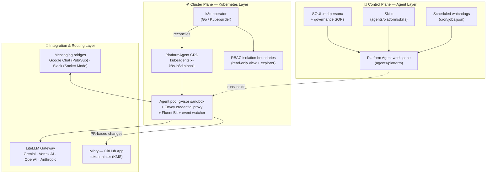

# 🧭 kube-agents — The Kubernetes Agentic Harness

**Stop driving your clusters. Start delegating them.**

`kube-agents` replaces the traditional imperative DevOps presentation layer — `kubectl`, `gcloud`, the Google Cloud Console — with autonomous, proactive AI agents that manage your Kubernetes/GKE infrastructure, enforce multi-tenant governance, and continuously audit security posture. Instead of you reacting to pages and typing commands, a **Platform Agent** watches your fleet around the clock, opens pull requests with fixes, and reports to you in chat.

| Traditional Ops                              | With `kube-agents`                                                                                           |
| -------------------------------------------- | ------------------------------------------------------------------------------------------------------------ |
| Reactive, manual toil (`kubectl` + runbooks) | Proactive, intent-driven operations                                                                          |
| Drift discovered during incidents            | Scheduled compliance & blueprint audits ([autonomous watchdogs](agents/platform/cron/jobs.json))             |
| Hand-rolled RBAC and tenancy reviews         | Automated RBAC & boundary enforcement, [credential isolation by design](docs/credential-isolation-design.md) |
| Patch Tuesdays and CVE spreadsheets          | Daily vulnerability & patch scans with staggered rollout orchestration                                       |
| One human, one terminal                      | ChatOps with the agent over Google Chat & Slack                                                              |

📗 **Full documentation: [gke-labs.github.io/kube-agents](https://gke-labs.github.io/kube-agents/)**

[](https://gke-labs.github.io/kube-agents/)

_An SRE asks for a fleet self-health check; the agent answers in the thread. An illustrative replay — the names and figures are examples. It runs live at the top of the [documentation site](https://gke-labs.github.io/kube-agents/)._

## 💬 Five things to ask it

Each of these is a single chat message. The agent answers in the thread from read-only reads of the fleet, the GCP projects it monitors, and the linked GitOps repositories, and it recommends changes without applying them.

1. **"Which clusters are behind their release channel, and what would block upgrading them?"** — Every cluster's control-plane and node-pool versions against the channel default, with what would stop the upgrade named: drain-blocking PodDisruptionBudgets, maintenance exclusions, and node-pool version skew. Name a target version and it also scans the GitOps manifests for the `apiVersions` that version removes. ([`fleet-upgrade-verification`](agents/platform/skills/fleet-upgrade-verification/SKILL.md))
2. **"Which workloads request far more CPU and memory than they use?"** — Live `kubectl top` readings compared with each workload's requests, so the answer names the over-requested controllers in resource units; a stock install has no billing export to price them. ([`gke-cost-analysis`](agents/platform/skills/gke-cost-analysis/SKILL.md))
3. **"Design a Standard cluster for 32 A100s in us-central1. Check quota and live obtainability, and give me a ComputeClass fallback. Design only."** — Quota and capacity are checked separately, each against live `gcloud` evidence, and the design names the fallback tiers that change the workload's GPU class or interconnect characteristics. ([`capacity-obtainability`](agents/platform/skills/capacity-obtainability/SKILL.md), [`gke-compute-classes`](agents/platform/skills/gke-compute-classes/SKILL.md))
4. **"Something in the `payments` namespace on `prod-east` stopped making progress without erroring. Find it."** — The work is delegated to the Cluster Agent for that cluster, which looks for controllers whose `observedGeneration` lags, progress conditions that stopped advancing, repeating warning events, and references to objects that do not exist. ([`gke-stall-detection`](agents/cluster/skills/gke-stall-detection/SKILL.md))
5. **"`checkout` on `prod-east` has been crash-looping since this morning. What happened?"** — The Cluster Agent for that cluster fixes the time window, reads the container's exit codes and the events around them, tells an OOM kill from an application crash, and proposes the manifest correction without applying it. ([`gke-workload-troubleshooting`](agents/cluster/skills/gke-workload-troubleshooting/SKILL.md))

---

## ⚡ Try it now

The fastest, zero-friction way to install `kube-agents` in **Google Cloud Shell** or your terminal:

```bash
curl -fsSL https://raw.githubusercontent.com/gke-labs/kube-agents/<RELEASE_VERSION>/install.sh | bash
```

_Substitute `<RELEASE_VERSION>` with the desired version tag from [GitHub Releases](https://github.com/gke-labs/kube-agents/releases) (for example, `0.4.0`)._

This interactive installer (recommended for initial setup) guides you through GCP authentication, project selection, GKE cluster setup (Autopilot or Standard), chat integrations (Google Chat & Slack), and LLM model provider credentials. Sensible defaults are detected from your `gcloud` context, requiring minimal input.

### 🤖 AI Agent & Automation Usage

For automated environments, CI/CD pipelines, and AI Agents where no interactive TTY is available, invoke the release installer with `--non-interactive` and CLI flags:

```bash
curl -fsSL https://raw.githubusercontent.com/gke-labs/kube-agents/<RELEASE_VERSION>/install.sh | bash -s -- \
  --non-interactive \
  --gcp-project-id="my-gcp-project" \
  --gke-cluster-name="platform-agent-host" \
  --gcp-region="us-central1" \
  --model-provider="gemini" \
  --permission-set="read-only"
```

Or give this prompt to an AI coding assistant. It needs no checkout of this repository, and tells the assistant to confirm the target with you and show you the `--dry-run` summary before it creates any cloud resources:

```text
Install the latest official release of kube-agents (github.com/gke-labs/kube-agents) into my GCP project.
Follow INSTALL.md from that release tag — do not invent installer URLs, namespaces, or model names.
First inspect my gcloud project and existing GKE clusters and confirm the target, cluster, model provider,
and credential with me. Run install.sh with --dry-run and show me its printed summary before you change anything.
Only run the real install after I say yes.
```

The full procedure behind the prompt, including the credential and consent-flag checks, is in [INSTALL.md](INSTALL.md#ai-assisted-installation). An assistant working in a checkout of this repository also picks up the [`install-kube-agents`](.agents/skills/install-kube-agents/SKILL.md) skill, which covers the same install.

Prefer to drive the engine by hand? Unpack `kube-agents-<RELEASE_VERSION>.tar.gz` from [GitHub Releases](https://github.com/gke-labs/kube-agents/releases) (recommended), or clone the repository at an official release tag if a Git checkout is needed:

```bash
curl -fsSL https://github.com/gke-labs/kube-agents/releases/download/<RELEASE_VERSION>/kube-agents-<RELEASE_VERSION>.tar.gz | tar -xz
cd kube-agents-<RELEASE_VERSION>
./install.sh                                              # the interview, then one terraform apply
# or, if a Git checkout is needed instead:
# git clone --branch <RELEASE_VERSION> https://github.com/gke-labs/kube-agents.git
# cd kube-agents && ./install.sh
# or, with your own terraform.tfvars:
cd terraform/examples/full-install && ./lifecycle.sh apply
```

Both paths run the same engine: `terraform/examples/full-install` provisions every GCP resource and installs the Helm chart that owns every Kubernetes one, end to end and idempotently. `./uninstall.sh` (or `lifecycle.sh destroy`) reverses it. See the [quick start](https://gke-labs.github.io/kube-agents/install/quickstart-gke/) for the walkthrough, or [INSTALL.md](INSTALL.md) for manual and local-development paths.

---

## 📖 What it is

The harness runs co-located agents in a single operator-deployed pod: the **Planning Agent** — the conversational front door that receives every chat message, works out what it needs, and delegates that work over a shared kanban board — the **Platform Agent** — the master custodian and agent architect that manages the GKE infrastructure lifecycle, establishes multi-tenancy boundaries, and enforces fleet-wide compliance — and a **Cluster Agent** per managed cluster, a single-cluster SRE persona the Platform Agent scaffolds from the [`agents/cluster/`](agents/cluster/) template for runtime operations and workload debugging, with read-only access to the cluster it watches. The Platform Agent is driven by:

- 🧬 **A persona** — [`agents/platform/SOUL.md`](agents/platform/SOUL.md) defines its identity, its _Automation First_ rule (no manual cluster mutations; changes flow through declarative, PR-based workflows), and its _Least Privilege_ constraint.
- 📚 **Governance playbooks** — SOPs in [`agents/platform/governance/`](agents/platform/governance/) covering compliance and security audits, fleet consistency drift, cost analysis, stockout prevention, and security patch orchestration.
- 🛠️ **Skills** — task-focused `SKILL.md` bundles under [`agents/platform/skills/`](agents/platform/skills/): cluster creation, app onboarding, cost analysis, backup & DR, and manifest generation. Single-cluster runtime skills — workload troubleshooting, observability, autoscaling, storage — belong to the Cluster Agent in [`agents/cluster/skills/`](agents/cluster/skills/). See the [skill catalog](https://gke-labs.github.io/kube-agents/skills/).
- ⏰ **Autonomous watchdogs** — cron-driven governance jobs in [`agents/platform/cron/jobs.json`](agents/platform/cron/jobs.json) that keep the fleet honest without human prompting. Ticking belongs to the Planning Agent's gateway, the only running one, so a job on its roster advances the Platform Agent's schedule once a minute. See [proactive autonomy](https://gke-labs.github.io/kube-agents/overview/proactive-autonomy/).

The runtime is built on the Hermes agent framework and wires in MCP servers for platform control and GKE's hosted MCP endpoint, so the agent speaks to your clusters through structured tools rather than raw shell access.

---

## 🛡️ Governance & isolation

`kube-agents` is designed for enterprise fleets where agents must be powerful _and_ provably contained:

- **Least-privilege RBAC** — the agent's Kubernetes identity is read-only and cannot read Secrets.
- **Credential isolation** — model-authored code runs in a shell sandbox pod that holds no API keys or tokens; an Envoy credential broker in a pod of its own injects them at the network boundary.
- **At-rest database encryption & state security** — GKE etcd database encryption (CMEK) via Cloud KMS, strict state file permissions (`umask 077`), and mandatory encryption pre-flight gates.
- **Kernel-level sandboxing** — agent workloads run under a gVisor RuntimeClass (GKE Sandbox) by default; `--enable-gvisor=false` opts out.
- **GitOps-only mutations** — infrastructure changes are proposed as pull requests for human review.

Exactly what is _enforced_ on which plane — Kubernetes RBAC, GCP IAM, and the GitOps path each answer differently — is set out in [Security & IAM](https://gke-labs.github.io/kube-agents/reference/security-and-iam/#what-the-agent-can-and-cannot-do). Read that before granting the agent access to a production project.

---

## 🏗️ Architecture



Walkthrough: [Architecture](https://gke-labs.github.io/kube-agents/overview/architecture/). The [`k8s-operator/`](k8s-operator/) reconciles `PlatformAgent` custom resources into the sandboxed agent pod, its sidecars, per-agent ServiceAccounts with Workload Identity, read-only RBAC, and Services.

> **Looking for the end-state design?** [`docs/architecture/`](docs/architecture/) specifies a three-tier, fully read-only agent model that this repository is converging toward. It describes the target, not what ships today.

---

## 🤝 Contributing

Contributions are welcome. See [CONTRIBUTING.md](CONTRIBUTING.md) for the CLA and where the contributor workflow is documented. Repository conventions for AI coding agents are in [AGENTS.md](AGENTS.md).

Bug reports and feature requests go in [issues](https://github.com/gke-labs/kube-agents/issues). If your GitHub account cannot open one here, use the [feedback form](https://gke-labs.github.io/kube-agents/feedback), which files it for you.

## Disclaimer

This is not an officially supported Google product.

This project is not eligible for the Google Open Source Software Vulnerability Rewards Program.
