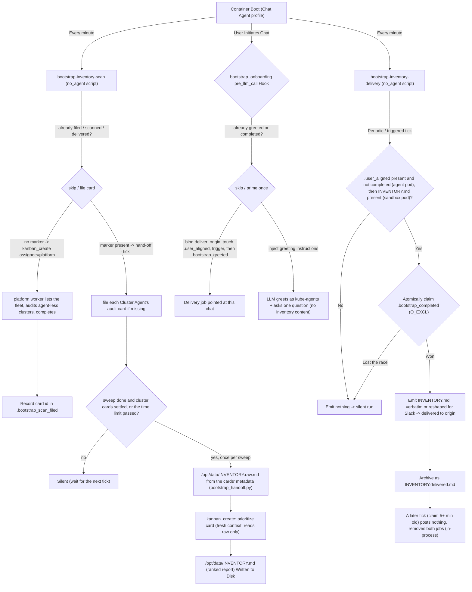
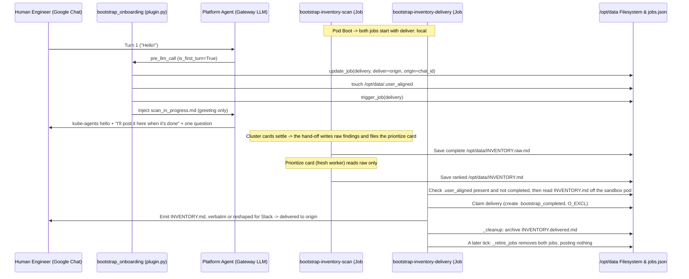

# First-Time Onboarding & Bootstrap (`bootstrap_onboarding`)

This document describes the first-time onboarding and GKE environment-discovery flow. It covers how the flow works for platform engineers and the maintenance conventions and guardrails that future contributors (human or AI) must follow when changing this code.

**The flow lives on the `default` (Chat Agent) profile.** That placement is forced by two constraints introduced with the profile split:

- Every marker onboarding coordinates on (the agent-pod rows in §2) lives in the Chat Agent's home, and a job on another profile would gate itself on a different directory.
- The Chat Agent's toolsets are stripped to `mcp-router` + `kanban` (no terminal, gcloud, or kubectl), so it cannot perform the sweep itself.

A third constraint used to be the decisive one: only the `default` profile's cron ticked at all, so a job on `platform` stayed `enabled: true` with `last_run: None` forever. That is fixed — `profile_cron_tick.py` ticks every named profile's store — but the two above still hold.

The sweep is therefore **delegated to the `platform` specialist as a kanban task**, while the markers stay in the Chat Agent's home (`/opt/data`). The reports are not markers and live elsewhere, on the shell sandbox pod (`platform-agent-shell-0`), where the ranking worker's terminal runs: the hand-off writes `INVENTORY.raw.md` there over `sandbox_exec`, and the ranking worker writes `INVENTORY.md` through its terminal, so both are on that pod's `/opt/data`. The agent pod does not mount that volume; the delivery job reads the report across (step 3).

---

## 1. System Overview

When a fresh pod starts on a newly onboarded Google Kubernetes Engine (GKE) cluster — or on a new persistent volume (`PVC`) — it runs a deterministic, first-time discovery and onboarding flow made of four parts:

1. **`bootstrap-inventory-scan`** — a `no_agent` cron job on the Chat Agent profile, scheduled `* * * * *`. Because a `no_agent` script is a plain subprocess, it is not bound by the Chat Agent's toolset denylist, but it still cannot reason — so it does not scan. It first runs `cluster_agent_reconcile.py` to completion and retries on the next tick while that fails — but it gives up once the failures pass both thresholds (see `.bootstrap_reconcile_attempts` below) and files anyway, because onboarding runs once and an unreconcilable roster must not hold it shut forever. So the card body never claims the roster is current: it tells the worker to audit every cluster the projects in scope have and to name the ones with no Cluster Agent, which is how a degraded sweep reaches the user as one. It then files a **kanban task assigned to `platform`** carrying the inventory SOP. The gate reads the roster — every Cluster Agent that is ready and has a readable cluster identity — from the profiles in the agent pod, because the worker's terminal runs in the shell sandbox, which has neither `hermes` nor the profiles' configuration, and lists it in the card. Ready means what `platform_control`'s `list_cluster_profiles` means by it: Hermes registered the profile (`profile.yaml`) and the reconcile finished scaffolding it (`USER.md`). A profile that is not ready or cannot be read is left out and its cluster falls to the worker; if the gate cannot list the profiles at all, the card lists none and the worker audits every cluster itself. That privileged worker lists the fleet, audits any cluster the roster does not cover, and completes its card. The audit cards themselves, one per Cluster Agent that is ready, each running the single-cluster audit SOP as that cluster's own read-only Cluster Agent, are filed by the gate: asked to make those calls itself, the worker once completed saying it had fanned out to seven clusters having filed none, and the report that followed called the fleet clean. The gate files the sweep card **once**: its id is recorded in `/opt/data/.bootstrap_scan_filed`, and while that marker exists the job never files again. Instead, each tick runs the **hand-off** (`scripts/bootstrap_handoff.py`): it files any Cluster Agent's audit card that is missing for this sweep, and once the sweep card has finished (`done`, `failed` or `cancelled`) and every per-cluster card has finished (`done`, `blocked`, `triage`, `failed` or `cancelled`), or at the time limit (an hour after the sweep was filed, plus five minutes per cluster card), it merges the cards' structured `metadata` (node pools, networking, Workload Identity, workload SRE posture) into the **complete** findings at `/opt/data/INVENTORY.raw.md`, with its machine-readable findings block and a gap line for every cluster that did not report, and files the prioritization card. `.bootstrap_handoff_filed` records which sweep was handed off, so it happens once per sweep. This step is a script rather than the worker's job because the worker has no tool that waits reliably, and typed by hand the raw file lost its findings block.
2. **Prioritization** — a second kanban card, filed by the hand-off once the raw findings are on disk (`idempotency_key='bootstrap-inventory-prioritize'`), unless no cluster's audit reached them: then the hand-off writes `INVENTORY.md` itself, saying no cluster was audited, and no ranking card is filed. That worker reads `INVENTORY.raw.md` and **nothing else**, scores every finding against the rubric in `inventory_prioritize_sop.md`, registers all of them in the findings queue, and writes the short report the user actually receives to `/opt/data/INVENTORY.md` from the top of the order the queue computes. It does not choose which findings there are: `scripts/inventory_findings.py extract` reads them out of the raw file's machine-readable block and `register` refuses to send anything until every extracted finding carries a score, so the worker cannot register a subset. Ranking is a separate card rather than a final step of the sweep because it must see only the findings: run inline, it would rank them against the sweep's own transcript as well, so the same cluster would yield a different report depending on how the sweep happened to go. The full findings stay on disk, the report still shows at most five items, and where it leaves anything out it ends with a count of what is queued behind it.
3. **`bootstrap-inventory-delivery`** — a `no_agent` cron job, scheduled `* * * * *`. Its script emits `/opt/data/INVENTORY.md` to stdout, which the scheduler delivers to the chat, but only when the report exists _and_ a human has connected — and only after it has atomically claimed the delivery, so two overlapping runs cannot both send it. It checks its two markers on the agent pod first, and only then reads the report off the sandbox pod with `sandbox_exec.read_bytes`; an unreachable sandbox is a silent run retried on the next tick, and a read that reaches the sandbox and does not return the report fails the run with the reason. No LLM is involved in delivery: what prioritization (or, with nothing audited, the hand-off) wrote is what the user receives, **verbatim** unless `KAGE_SLACK_UX` is on and the job is bound to Slack. There `inventory_presenter.py` reshapes it deterministically, with one number on it, the total: a bold headline it writes from the posture's own counts ("I scanned 3 clusters and 41 workloads and found 22 things to look at."), the posture's own clause saying what could not be scanned, when it has one, as a plain line under it, a lead such as "Two are worth fixing first:" when the total is more than the rows shown, then the top two findings and every finding the report labels critical a row each (led by its severity when the report labels a finding's severity), or the whole list when it runs past the SOP's five, which the SOP allows only for an all-critical list, each with the sentence under it kept as written. The total is every listed finding plus the roll-up's count: the total the roll-up states for itself ("18 more items: 2 high, 16 low" is 18), or its terms summed when it states none. With no roll-up it is a closing line's "all N findings", then the posture's finding count after a scan verb ("I scanned 3 clusters and found 22 findings"), then the largest "N findings in total" in the closing lines, then any other finding count in the posture, then the listed findings. The rest of the findings, the rest of the posture and the roll-up paragraph are left out; the other closing lines are kept as written, since they are how a reader asks for the rest, and when the roll-up was the last line, "Ask me to see all N." takes its place. A report it cannot parse still goes out verbatim, and `INVENTORY.delivered.md` is always the original. When the Slack relay is also configured, the script posts the same headline, lead and rows as a Block Kit card itself and prints nothing, with a "Fix the first one" button, whose click posts its label as the user's turn in the thread, and, again only when the total is more than the rows shown, a "See all N" button; the card leaves the closing line off too, since "See all N" asks for the rest. Where Slack refuses the card or the relay fails, it prints the text instead. A failure after the request was sent may already have posted, so that path can send the report twice: the claim makes one delivery run per report, and a second copy is the smaller loss than none. With `KAGE_SLACK_UX` on and the job bound to Slack, the text it prints posts without the scheduler's `Cronjob Response` header, job ID and footer (`deploy/docker/patches/slack_boilerplate.py`).
4. **`bootstrap_onboarding` plugin** — a `pre_llm_call` lifecycle hook. On the first human turn from a supported durable chat adapter it greets the user, records that a human is present, points the delivery job at this chat, and asks it to fire promptly. Request/response and local surfaces stay silent because they cannot receive a later delivery. The plugin never presents the report itself, and it greets exactly once per deployment. The one exception is the bench's eval seam (Rule 5), which greets matching API-server turns and writes no marker.

`INVENTORY.md` is still the single signal that means "ready to deliver" — it now simply appears one stage later. Nothing in the delivery job or the plugin changed when prioritization was added.

### One-time means one time (the guarantee, and where it comes from)

Onboarding is a one-shot event, but its stages become observable at different moments, minutes apart. **Each stage therefore owns a durable marker that it writes at the moment it acts** — not one shared marker written at the end.

That last distinction is the whole design. `.bootstrap_completed` exists only after a report has been _delivered_, which requires both a finished sweep and a human in the chat. Everything before that point can sit unmarked for many minutes — or forever, if the sweep fails. A stage that asks "has onboarding completed?" to decide whether to start is really asking a question whose answer is "no" for the entire window in which it is being re-run every 60 seconds. Ask instead "has _this stage_ already acted?", and each of these is answerable immediately:

| Stage            | Marker written when it acts | What re-runs without it                                                           |
| :--------------- | :-------------------------- | :-------------------------------------------------------------------------------- |
| card filed       | `.bootstrap_scan_filed`     | a fresh fleet-wide sweep filed every minute for the length of the sweep           |
| sweep handed off | `.bootstrap_handoff_filed`  | the raw file rewritten and the ranking card's create repeated every minute        |
| user greeted     | `.bootstrap_greeted`        | a fresh greeting per new session, each re-pointing delivery at whoever spoke last |
| report delivered | `.bootstrap_completed`      | the full report posted once per overlapping delivery run                          |

Do not replace these with a check on board state, on `INVENTORY.md`, or on `.bootstrap_completed` alone; see Rule 8.

The hand-off runs on the scan job's every-minute tick, so it got a marker of its own when it moved there: `.bootstrap_handoff_filed` names the sweep it handed off, which keeps a re-armed sweep, whose runbook deletes `.bootstrap_scan_filed` but may leave this file, from being skipped. The ranking card it files is still guarded by its `idempotency_key` as well, and delivery claims atomically downstream, so the user sees one report even if both slip.

### Why two jobs? (the load-bearing reason)

The scheduler snapshots a job's delivery destination (`deliver` / `origin`) into memory **when the run starts** (`get_due_jobs` deep-copies `jobs.json`), and delivers the result to that snapshot at the end — it does not re-read the destination from disk after the turn. The scan is long-running and boots with `deliver: local` (no user yet). If the _same_ job also delivered the report, a user who connects mid-scan could not redirect it: their chat is written to disk as `deliver: origin`, but the in-flight scan already cached `deliver: local`, so the report would be lost.

Splitting delivery into a separate, short job fixes this: it starts on a fresh tick _after_ the plugin has written `deliver: origin` to disk, so it reads the correct destination. This separation is mandatory — do not merge the two jobs (see Rule 1).



---

## 2. Coordination State Markers (`/opt/data/`)

The flow coordinates state through flag files under the agent pod's `/opt/data/`, and through the two reports on the sandbox pod's `/opt/data/`:

| Marker                                        | Created By                                                                              | Lifecycle & Purpose                                                                                                                                                                                                                                                                                                                                                                                                                                                                                                                                                                                                                                                                                                                                                                                                                                                                                                                                                                                                                                                                                                                                                                                                                                                                                                                                                                                                                                                                                                                                                 |
| :-------------------------------------------- | :-------------------------------------------------------------------------------------- | :------------------------------------------------------------------------------------------------------------------------------------------------------------------------------------------------------------------------------------------------------------------------------------------------------------------------------------------------------------------------------------------------------------------------------------------------------------------------------------------------------------------------------------------------------------------------------------------------------------------------------------------------------------------------------------------------------------------------------------------------------------------------------------------------------------------------------------------------------------------------------------------------------------------------------------------------------------------------------------------------------------------------------------------------------------------------------------------------------------------------------------------------------------------------------------------------------------------------------------------------------------------------------------------------------------------------------------------------------------------------------------------------------------------------------------------------------------------------------------------------------------------------------------------------------------------ |
| **`/opt/data/.bootstrap_scan_filed`**         | `bootstrap_scan_gate.py`                                                                | Written the moment the sweep card is filed, and contains that card's id. Its presence is what stops the every-minute job filing a second sweep during the many minutes the first one takes. Written only for a card the board confirmed, so a failed create retries on the next tick. Archive the previous run's `bootstrap-inventory-*` cards, then delete it together with `INVENTORY.raw.md`, to deliberately re-arm discovery (see the runbook in §5); alone it leaves the gate closed.                                                                                                                                                                                                                                                                                                                                                                                                                                                                                                                                                                                                                                                                                                                                                                                                                                                                                                                                                                                                                                                                         |
| **`/opt/data/.cluster_agent_reconcile.lock`** | `cluster_agent_reconcile.py`                                                            | An empty `flock` file, held for the duration of a reconcile run. Two schedules run that script — this gate every minute, and the hourly `cluster-agent-reconcile` job — and the gateway's cron lock is per job id, so the lock lives in the script rather than in either caller. A run that cannot take it returns without reconciling, and exits `EXIT_ALREADY_RUNNING` (4) only under `--require-create-pass` — so the gate reads 4 as "retry next tick" and does not count it against the attempt ceiling, while the hourly job, which passes no flags, exits 0 as every cron producer must. Never cleaned up; its contents are irrelevant.                                                                                                                                                                                                                                                                                                                                                                                                                                                                                                                                                                                                                                                                                                                                                                                                                                                                                                                      |
| **`/opt/data/fleet_scope.json`**              | `cluster_agent_reconcile.py`                                                            | The resolved scope: every project the last run listed with its outcome. The gate reads it to tell the sweep which projects in scope were not listed and which folders, organisations, Shared VPC hosts or Metrics Scopes could not be resolved, so a partial roster reads as partial. Rewritten by every reconcile run except `--dry-run`; never cleaned up.                                                                                                                                                                                                                                                                                                                                                                                                                                                                                                                                                                                                                                                                                                                                                                                                                                                                                                                                                                                                                                                                                                                                                                                                        |
| **`/opt/data/.bootstrap_reconcile_attempts`** | `bootstrap_scan_gate.py`                                                                | Two lines: the number of consecutive failed reconciles, and the epoch seconds of the first failure in that streak. Reset to a bare `0` on success, which drops the timestamp and starts the next streak fresh. The gate stops waiting and files the sweep against whatever roster exists only once **both** `MAX_RECONCILE_ATTEMPTS` and `RECONCILE_GIVE_UP_SECONDS` are satisfied, so a reconcile that can never succeed (no IAM to list clusters) cannot hold onboarding shut, while one that is merely slow to recover gets the wall-clock window instead of five one-minute ticks. A counter left by an older build has no second line and gives up on the count alone. **Delete it whenever you re-arm discovery** — an exhausted counter left behind means the next run skips the reconcile and files a solo sweep.                                                                                                                                                                                                                                                                                                                                                                                                                                                                                                                                                                                                                                                                                                                                           |
| **`/opt/data/.bootstrap_handoff_filed`**      | `bootstrap_handoff.py`                                                                  | Three lines: `sweep=` the sweep card handed off, `task_id=` the ranking card it filed (`none` when no cluster was audited and it wrote the report itself), `filed_at=`. Written only after the board confirmed the ranking card, or, when no cluster was audited, after the hand-off wrote `INVENTORY.md` itself. An open card under the ranking key that an earlier run left, or that does not carry the hand-off's own body (such as one a sweep worker filed before the raw file existed), is archived first, so the board cannot hand it back as this sweep's; the hand-off's own card is kept whatever its status, so a tick that filed it but could not write this marker finds it again. While it names the current sweep, the hand-off is a no-op; it names the sweep rather than being a bare flag so that a re-armed discovery gets its own hand-off without anyone having to delete it. The hand-off also leaves alone a sweep whose card, or every one of whose per-cluster cards, is archived, which is how a re-arm or a bench stack cancels one; a single archived card among live ones only drops that cluster, as a gap, so archiving the only card of a one-cluster fleet cancels the sweep. A blocked or triage sweep card waits for the limit, one hour plus five minutes per cluster card; a failed or cancelled one does not. A raw file already in place, such as one an earlier sweep shape typed itself on an install upgraded mid-onboarding, is replaced by one built from the cards, so the ranking stage always gets a findings block. |
| **`/opt/data/INVENTORY.raw.md`**              | `bootstrap_handoff.py`, on the gate's tick                                              | The findings set — every finding each cluster's audit reported, with the fleet, workload and gap tables the hand-off renders around it, and no length limit. Written over `sandbox_exec` as the terminal's login, so it is on the sandbox pod. Never delivered to chat. Its presence means the hand-off ran, possibly at the time limit with gaps; prioritization may still be running. **It is never cleaned up**, on purpose: it is what a later "show me the full inventory" request is served from. That also means re-arming discovery requires deleting it (see §5).                                                                                                                                                                                                                                                                                                                                                                                                                                                                                                                                                                                                                                                                                                                                                                                                                                                                                                                                                                                          |
| **`/opt/data/INVENTORY.md`**                  | the prioritization kanban worker, or `bootstrap_handoff.py` when no cluster was audited | The ranked report, delivered verbatim or reshaped for Slack, written from `INVENTORY.raw.md` alone. When no cluster's audit reached the raw file, the hand-off writes this file itself instead, saying no cluster was audited and listing the raw file's gaps, and files no ranking card: ranked, an empty raw file reads as a clean environment. Written to this absolute path (not the worker's own profile home) through the worker's terminal, so it is on the sandbox pod, where the delivery script reads it. Its presence means the report is ready to send — unchanged as the delivery signal, it simply arrives one stage later than it used to. Renamed to `INVENTORY.delivered.md` on the sandbox pod by the delivery script (`_cleanup`) after the report is emitted.                                                                                                                                                                                                                                                                                                                                                                                                                                                                                                                                                                                                                                                                                                                                                                                   |
| **`/opt/data/.user_aligned`**                 | Python, in `plugin.py`                                                                  | Touched in `handle_pre_llm_call` on the first interactive user turn, and only once an origin has been bound. Signals to the delivery job that a human has joined the chat. **Safety rule:** background tasks must never create or write this marker (see Rule 4).                                                                                                                                                                                                                                                                                                                                                                                                                                                                                                                                                                                                                                                                                                                                                                                                                                                                                                                                                                                                                                                                                                                                                                                                                                                                                                   |
| **`/opt/data/.bootstrap_greeted`**            | Python, in `plugin.py`                                                                  | Written after the opening turn has been primed. Every new session's first turn re-enters the hook, so without this the greeting, the presence marker, and the delivery re-binding all repeat per session until a report is finally delivered.                                                                                                                                                                                                                                                                                                                                                                                                                                                                                                                                                                                                                                                                                                                                                                                                                                                                                                                                                                                                                                                                                                                                                                                                                                                                                                                       |
| **`/opt/data/.bootstrap_completed`**          | `bootstrap_delivery.py` (`_claim_delivery`)                                             | Created with `O_CREAT \| O_EXCL` **before** the report reaches stdout — it is the delivery claim, not a receipt. Whichever run wins the create delivers; any other run exits silently. Its presence also means onboarding is permanently done: the plugin stays quiet, and the first delivery tick that finds it at least `RETIRE_AFTER_SECONDS` (five minutes) old removes both jobs, scan job first. A failed delivery-job removal is retried on the next tick; a failed scan-job removal leaves that job in place, where it does nothing once this marker exists.                                                                                                                                                                                                                                                                                                                                                                                                                                                                                                                                                                                                                                                                                                                                                                                                                                                                                                                                                                                                |
| **`/opt/data/.bootstrap_greet_eval-<case>`**  | the first-install-hello bench stack                                                     | The eval seam (Rule 5): a request for the greeting, JSON `phrase`, `variant` and `written_at`, answered on every API-server turn whose message contains the phrase until the stack's destroy removes it or an hour after `written_at`. Nothing on a real install writes it.                                                                                                                                                                                                                                                                                                                                                                                                                                                                                                                                                                                                                                                                                                                                                                                                                                                                                                                                                                                                                                                                                                                                                                                                                                                                                         |

---

## 3. Operational Cases

Both cases converge on the same delivery path: the `no_agent` delivery job posts `INVENTORY.md` (verbatim, or reshaped for Slack with `KAGE_SLACK_UX` on) once the ranked report is on disk and a human is present. The only difference is timing.

### Case A: User engages before the scan completes (mid-scan)

1. **Turn 1 (`pre_llm_call`):** With `is_first_turn=True` and a supported durable chat adapter, the plugin:
   - binds the delivery job to this chat — reads `HERMES_SESSION_PLATFORM` / `HERMES_SESSION_CHAT_ID` / `HERMES_SESSION_THREAD_ID` and calls `update_job("bootstrap-inventory-delivery", {"deliver": "origin", "origin": {...}})` — **before** touching `.user_aligned`, so the job can never fire against a stale target;
   - touches `/opt/data/.user_aligned`;
   - calls `trigger_job("bootstrap-inventory-delivery")` so it fires on the next tick;
   - writes `.bootstrap_greeted` so no later session repeats any of the above;
   - injects `defaults/onboarding/scan_in_progress.md` (a short kube-agents greeting: read-only, "I'll post what I find here when it's done", changes come as pull requests, one closing question). It does **not** inject the inventory.

   If the turn is not from a supported durable chat adapter, or no chat origin can be bound, the plugin writes **no** markers and returns `None`: that turn has nowhere to deliver a later report, so onboarding stays armed for the next durable chat turn. An API-server turn matching an eval seam request (Rule 5) is greeted but still writes no marker. `DURABLE_CHAT_PLATFORMS` is a positive allowlist; new adapters must opt in only after implementing persistent delivery.

2. **Delivery job (each tick):** `INVENTORY.md` is still absent → the script emits nothing → silent run.
3. **Scan completes:** the gate files the per-Cluster-Agent audit cards and the `platform` worker lists the fleet and completes; once the per-cluster cards settle, the scan job's hand-off writes `/opt/data/INVENTORY.raw.md` and files the prioritization card (or, if no cluster was audited, writes `INVENTORY.md` itself). That worker ranks the findings and writes `/opt/data/INVENTORY.md`. The scan job has not filed again this whole time, on `.bootstrap_scan_filed`.
4. **Next delivery tick:** both `INVENTORY.md` and `.user_aligned` exist and `.bootstrap_completed` is absent → the script reads the report, claims delivery by creating `.bootstrap_completed` with `O_EXCL`, prints the report (reshaped for Slack with `KAGE_SLACK_UX` on, or posts it as Block Kit itself when the Slack relay is configured), and the scheduler delivers what was printed to the bound origin chat. `_cleanup` then archives the report as `INVENTORY.delivered.md`. The first delivery tick at least five minutes later finds `.bootstrap_completed`, posts nothing, and removes both onboarding jobs (`_retire_jobs`).



### Case B: User engages after the scan finished (quiet boot)

1. **Silent completion:** during the unattended boot the scan writes `/opt/data/INVENTORY.raw.md`, the prioritization card ranks it into `/opt/data/INVENTORY.md`, and both return `[SILENT]`. The delivery job stays silent because `.user_aligned` is absent, so the report waits on disk.
2. **Turn 1 (`pre_llm_call`):** the plugin does exactly the same things as in Case A (bind origin → touch `.user_aligned` → trigger delivery → mark `.bootstrap_greeted`) and picks its greeting by checking `INVENTORY.md` on the agent pod. With the shell sandbox off the report is there, so it injects `defaults/onboarding/scan_completed.md` (the same short greeting, saying the summary is in this chat and ending on an offer to start on a finding). With the sandbox on the report is on the sandbox pod, which the plugin does not read, so it injects `scan_in_progress.md` as in Case A even though the report is ready.
3. **Next delivery tick:** both files now exist → the script delivers `INVENTORY.md` to the origin chat, verbatim or reshaped for Slack as in Case A, and runs `_cleanup`; a later tick removes both jobs, as in Case A.

The report therefore arrives as its own message shortly after the greeting, identical to Case A — the user always sees the same report, never an LLM-reformatted one: verbatim, or the same deterministic reshape when it is reshaped for Slack with `KAGE_SLACK_UX` on.

```mermaid
sequenceDiagram
    participant Scan as bootstrap-inventory-scan (Job #1, LLM)
    participant Deliver as bootstrap-inventory-delivery (Job #2, no_agent script)
    participant Disk as /opt/data Filesystem
    participant User as Human Engineer (Google Chat)
    participant Hook as bootstrap_onboarding (plugin.py)
    participant Agent as Platform Agent (Gateway LLM)

    Note over Scan: Pod Boot -> Scan writes INVENTORY.raw.md, prioritize card writes INVENTORY.md, both [SILENT]
    Deliver->>Disk: Check .user_aligned -> ABSENT (no human yet) -> silent
    Note over User,Agent: Unattended interval passes...
    User->>Agent: Turn 1 ("Hello!")
    Agent->>Hook: pre_llm_call (is_first_turn=True)
    Hook->>Disk: update_job(delivery, deliver=origin) ; touch .user_aligned ; trigger_job(delivery)
    Hook->>Agent: Inject scan_completed.md, or scan_in_progress.md with the sandbox on (greeting only)
    Agent->>User: kube-agents hello + "the summary is in this chat" + one question
    Deliver->>Disk: Claim delivery (create .bootstrap_completed, O_EXCL)
    Deliver->>User: Emit INVENTORY.md, verbatim or reshaped for Slack -> delivered to origin
    Deliver->>Disk: _cleanup: archive INVENTORY.delivered.md
    Deliver->>Disk: A later tick: _retire_jobs removes both jobs, posting nothing
```

---

## 4. Architectural Rules & Implementation Principles (for future maintainers)

When changing onboarding instructions, scripts, or the plugin under `agents/chat/`, follow these guardrails.

### 0. Keep the whole flow on the `default` (Chat Agent) profile

- **Rule:** Do not relocate any part of this flow to `agents/platform/`.
- **Why:** Onboarding's state lives in the Chat Agent's home. A job moved to the platform profile would gate itself on that profile's `HERMES_HOME` instead, so `.bootstrap_scan_filed` would stop being the marker the delivery job and the greeting hook read — and the sweep would re-file, or be delivered twice. (Cron on a named profile does fire now, via `profile_cron_tick.py`; it did not before, and that used to be the reason for this rule.) If a step needs privileged tools, delegate it as a kanban task to `platform` (as the scan does) instead of moving the job.
- **Corollary:** Any file the two halves share must be an absolute path under `/opt/data`. A `platform` worker's `HERMES_HOME` is its own profile home, so a relative path silently lands somewhere the delivery job will never look.

### 1. Keep discovery and delivery in separate jobs (avoids a scheduler race)

- **Rule:** Never merge `bootstrap-inventory-scan` and `bootstrap-inventory-delivery` into one job.
- **Why:** The scheduler caches a job's `deliver`/`origin` in memory at run start and never re-reads it. A long combined job would deliver to whatever destination it snapshotted at boot (`local`), ignoring a `deliver: origin` a user set mid-run — losing the report. The separate delivery job starts on a fresh tick and reads the current destination. (See "Why two jobs?" above.)

### 2. Do cleanup in code, not via LLM terminal commands

- **Rule:** Onboarding cleanup runs deterministically in code — the delivery script's `_cleanup` (archives the report) and `_retire_jobs` (`cron.jobs.remove_job`, in-process) — never by instructing the model to run `hermes cron rm` or delete state from a chat turn.
- **Why:** Determinism. A model may forget a step, run the wrong command, or reformat state.
- **Trap:** never remove the delivery job from the run that delivers. Removing a job while it runs drops that run's fire claim, and the scheduler discards the run's output instead of posting it, so the report never reaches the chat. `_retire_jobs` runs on a later tick, which has nothing to post.

### 3. Verify state with absolute paths, not relative queries

- **Rule:** Scripts and checklists resolve markers under `HERMES_HOME` (`/opt/data`) — e.g. `Path(os.environ.get("HERMES_HOME", "/opt/data")) / ".bootstrap_completed"`, or `test -e /opt/data/INVENTORY.md` in a worker's terminal. A script in the agent pod that needs a report reads it off the sandbox pod by absolute path, as `bootstrap_delivery.py` does.
- **Why:** Jobs and turns often run from a subdirectory, so relative or wildcard lookups can miss markers outside the working tree.

### 4. Background tasks must never touch `.user_aligned` (avoids autonomous goal-seeking)

- **Rule:** Only the plugin's `pre_llm_call` (a real human turn) may create `/opt/data/.user_aligned`. The scan and delivery jobs must never write it.
- **Why:** `.user_aligned` is the "a human is present" signal that unlocks delivery. If a background task could forge it, an unattended boot would broadcast the report to nobody and prematurely mark onboarding complete.

### 5. Accept only durable chat delivery inside `pre_llm_call`

- **Rule:** Every scheduled cron run starts a fresh turn loop with `is_first_turn == True`, and request/response surfaces may also look interactive without supporting a later delivery. `handle_pre_llm_call` must require a supported durable chat platform before touching flags or serving prompts:
  ```python
  platform_name = str(kwargs.get("platform", "")).lower()
  session_id = str(kwargs.get("session_id", ""))
  if platform_name == "cron" or session_id.startswith("cron_"):
      return None
  if platform_name not in DURABLE_CHAT_PLATFORMS:
      return None
  ```
  Cron sessions use `platform="cron"` and a `session_id` of the form `cron_<job_id>_<timestamp>`, so either cron check is sufficient. The positive durable-platform check makes all other non-deliverable surfaces fail closed and prevents the greeting from promising a follow-up they cannot receive.
- **The one exception is the eval seam.** Between the cron check and the first-turn check, a `.bootstrap_greet_eval-<case>` request whose phrase is in the user's message has its variant's greeting injected on an API-server turn; a chat platform's turns never consult it, and a phrase under 12 characters, or a request more than an hour from its `written_at`, is ignored with a warning. The file stays until the stack's destroy, because the bench re-sends a dropped opening turn in the same conversation, where it is no longer a first turn; the destroy reads back and fails when the file is still there. It binds no delivery and writes no marker, so onboarding state is the same after it as before. Only `bench/tf/prebuilt/first-install-hello` writes one, one per case so a concurrent case never matches another case's request; `test_plugin.py` fails if anything else in the repository names the prefix.

### 6. Enable native multi-chunk delivery (`splits_long_messages`)

- **Rule:** `register(ctx)` sets `GoogleChatAdapter.splits_long_messages = True`.
- **Why:** The delivery router (`gateway/delivery.py`) truncates messages over `MAX_PLATFORM_OUTPUT` (4000 chars) with a `... [truncated, ...]` footer unless the adapter declares `splits_long_messages`. `GoogleChatAdapter` chunks long text in its `send()` (via `_chunk_text`) but does not declare the flag, so without this a long `INVENTORY.md` would be truncated before it reaches `send()`. The prioritized report is written to fit inside 4000 chars, so this no longer fires on the happy path — keep it anyway. It still covers a report that runs long because the sweep found a lot that is genuinely broken, and it covers the full-inventory reply a user can ask for afterward, which is not length-limited at all.

### 7. The two inventory files have opposite obligations

- **Rule:** `INVENTORY.raw.md` (written by `scripts/bootstrap_handoff.py` from the cluster cards' `metadata`) must carry **every finding** the audits reported, untrimmed, in its plan and in a ```findings block carrying one line per affected object. That block is what prioritization registers, so a problem named only in the prose plan is invisible to the queue. `INVENTORY.md` (written by `governance/inventory_prioritize_sop.md`) must be **short and self-contained**: a ranked selection, a roll-up count of what it left out, and under 4000 chars. The hand-off's own `INVENTORY.md`, written when no cluster was audited, says so and lists at most the first gaps, with a count of the rest and a pointer to the raw file.
- **Why:** Whichever file is wrong costs something different. Trim the raw file and the finding is gone for good — prioritization reads that file and nothing else, so an omission there is invisible for the rest of onboarding and for any later full-inventory request. Pad the report and the user is back to the wall of text this stage exists to prevent.
- **Corollary:** Prioritization must not re-run discovery, and must not add findings the sweep did not record. Its input is one file. A report that describes something absent from `INVENTORY.raw.md` was invented.

### 8. Every once-only step writes its own marker, at the moment it acts

- **Rule:** A stage that must happen once decides by reading a marker it owns and writes at the instant it acts — never by inferring from board state, from `INVENTORY.md`, or from `.bootstrap_completed` alone. Where two runs can race (delivery), the marker must be _claimed_ atomically (`O_CREAT | O_EXCL`) before the side effect, not written after it.
- **Why:** This is the bug the flow shipped with, and it is easy to reintroduce because the wrong version reads correctly. Both onboarding jobs run every 60 seconds while the work they guard takes minutes, so any gap between "acted" and "observably finished" is re-entered dozens of times.
  - The scan gate skipped only on `INVENTORY.md` / `.bootstrap_completed`, neither of which exists during the sweep, and leaned on the board's `idempotency_key`. When the sweep began delegating to subagents, the filed card started completing almost immediately (its job then was to fan out and stand down, with nothing behind it to collect the results; today the gate files the per-cluster cards itself and its hand-off collects them behind `.bootstrap_handoff_filed`, so the sweep card completes long before the audits do), so for the whole run the board said "done" and the disk said "no report" — and the gate re-filed a fleet-wide sweep every minute.
  - The plugin greeted on any first turn without `.bootstrap_completed`. Every new session sets `is_first_turn=True`, so a second user or a new thread re-greeted and re-pointed the delivery job at itself.
  - Delivery checked `.bootstrap_completed` and wrote it after emitting, leaving a window in which a scheduled tick and a `trigger_job` run could both send the report.
- **Corollary:** Do not treat an upstream dedupe (kanban's `idempotency_key`) as the guarantee. It is a useful backstop for the narrow window where a marker write fails, but it dedupes against non-archived rows in one board's database — an archived card, a rebuilt board, or a reset volume turns it back into no protection at all.

---

## 5. Quick Diagnostic Commands

Check the active markers in a live pod, and the reports on the sandbox pod. `ls` names each file that is missing, which in a normal run is most of them:

```bash
POD_NAME=$(kubectl get pods -n kubeagents-system -l app=platform-agent-gateway -o jsonpath='{.items[0].metadata.name}')
kubectl exec -n kubeagents-system ${POD_NAME} -c platform-agent -- ls -la --full-time /opt/data/.bootstrap_scan_filed /opt/data/.bootstrap_handoff_filed /opt/data/.user_aligned /opt/data/.bootstrap_greeted /opt/data/.bootstrap_completed
kubectl exec -n kubeagents-system platform-agent-shell-0 -c shell -- ls -la --full-time /opt/data/INVENTORY.raw.md /opt/data/INVENTORY.md /opt/data/INVENTORY.delivered.md
```

If onboarding has stalled, `.bootstrap_scan_filed` names the card to inspect:

```bash
kubectl exec -n kubeagents-system ${POD_NAME} -c platform-agent -- cat /opt/data/.bootstrap_scan_filed
```

A sweep card that is `done` with no `INVENTORY.raw.md` is the normal middle of a run while its cluster cards work. The hand-off is stuck, rather than waiting, when every Cluster Agent on the roster has a `bootstrap-inventory-cluster-*` card for this sweep, every such card has finished, and no `.bootstrap_handoff_filed` names the sweep a few minutes later — a roster agent with no card, or an earlier run's open card holding its key that the hand-off could not archive, keeps it waiting until the time limit; the hand-off's own reasons go to the scan job's stderr, which the scheduler discards on a zero exit, so read the board and the markers instead. `INVENTORY.raw.md` present without `INVENTORY.md` means prioritization is the stage that has not finished.

`INVENTORY.md` on the sandbox pod, with `.user_aligned` present and no `.bootstrap_completed` for more than a couple of minutes, means the delivery job is not running or cannot reach the sandbox over ssh. A run that cannot reach it exits 0, and the scheduler discards a zero-exit script's stderr, so it leaves no trace; `kubectl exec` does not go over ssh, so the commands above still work. The agent's terminal connects with the same key to the same host, so a shell command the Platform Agent runs fails the same way.

To deliberately re-run discovery, **archive the previous run's cards first**, while the markers
still keep the gate idle. The board answers a `kanban_create` whose idempotency key matches a card
that is not archived by returning that card and creating nothing, so a left-over
`bootstrap-inventory-scan` card makes the gate's re-file a no-op. A per-cluster card still open from
an interrupted sweep is archived by the hand-off before it files the new sweep's card, or, under a
key spelled differently, runs beside it for the same cluster. Archive the sweep card first: the
hand-off stands down once the sweep card is archived, while with only some per-cluster cards
archived it hands off the rest and reports the archived ones as gaps:

```bash
kubectl exec -i -n kubeagents-system ${POD_NAME} -c platform-agent -- /opt/hermes/.venv/bin/python3 - <<'PY'
import sqlite3, subprocess
board = sqlite3.connect("file:/opt/data/kanban.db?mode=ro", uri=True)
rows = board.execute(
    "SELECT id FROM tasks WHERE idempotency_key LIKE 'bootstrap-inventory-%' AND status != 'archived' "
    "ORDER BY idempotency_key = 'bootstrap-inventory-scan' DESC, created_at"
).fetchall()
for (task_id,) in rows:
    subprocess.run(["/opt/hermes/.venv/bin/hermes", "kanban", "archive", task_id], check=True)
left = board.execute(
    "SELECT id FROM tasks WHERE idempotency_key LIKE 'bootstrap-inventory-%' AND status != 'archived'"
).fetchall()
if left:
    raise SystemExit(f"still open: {[i for (i,) in left]}; the gate is still filing. Run this again.")
PY
```

Then remove the markers for the stages you want to repeat (`.bootstrap_scan_filed` to re-file the sweep, `.bootstrap_greeted` to re-greet, `.bootstrap_completed` to allow another delivery). **`INVENTORY.raw.md` on the sandbox pod must go too** — unlike the report, nothing ever cleans it up, and a stale one is what a person reading the sandbox takes for this run's findings until the hand-off writes the new one:

```bash
kubectl exec -n kubeagents-system ${POD_NAME} -c platform-agent -- rm -f /opt/data/.bootstrap_scan_filed /opt/data/.bootstrap_greeted /opt/data/.bootstrap_completed /opt/data/.bootstrap_reconcile_attempts
for p in $(kubectl get pods -n kubeagents-system -l app=platform-agent-shell -o name); do
  kubectl exec -n kubeagents-system "$p" -c shell -- rm -f /opt/data/INVENTORY.raw.md /opt/data/INVENTORY.md
done
```

**Once a report has been delivered, clearing markers is not enough.** `_retire_jobs` removes both
onboarding cron jobs a few minutes after a successful delivery, so there is nothing left to fire and a marker
reset produces silence. Check with `grep bootstrap /opt/data/cron/jobs.json` inside the pod; if the jobs are gone, either
re-add them; to file the sweep card yourself instead of waiting for the gate, re-add the scan job anyway, because the hand-off runs on its ticks. Archive the previous run's
cards first, as above: a left-over sweep card answers your create with itself, and a per-cluster
card under a key the hand-off does not file is never archived. Filing directly skips the gate's reconcile, and
the hand-off files cards from the roster it reads each tick, so run the reconcile first or it
files for a stale roster. Run these inside the agent
container, the first two with the Hermes interpreter named in full: the card body lists the Cluster
Agents read from the profiles there, reading them needs `yaml`, and a login shell resolves `python3`
to `/usr/bin/python3`, which does not have it:

```bash
/opt/hermes/.venv/bin/python /opt/data/scripts/cluster_agent_reconcile.py
BODY=$(/opt/hermes/.venv/bin/python -c "import sys; sys.path.insert(0,'/opt/data/scripts'); import bootstrap_scan_gate as g; print(g._task_body())")
# A placeholder first: with the scan job in place, a tick that finds no marker files its own sweep.
printf 'task_id=pending\n' > /opt/data/.bootstrap_scan_filed
hermes kanban create --json --assignee platform --idempotency-key bootstrap-inventory-scan-rerun-$(date +%s) \
  --body "$BODY" "First-time environment discovery: write the onboarding inventory report"
# The hand-off follows the sweep named here; without it, no raw file and no ranking card follow.
printf 'task_id=%s\nfiled_at=%s\n' <the id the create printed> "$(date +%s)" > /opt/data/.bootstrap_scan_filed
```

The hand-off runs on the `bootstrap-inventory-scan` job's ticks, so this path needs that job in place even though it skips the job's filing.

Use a fresh key anyway. `_cleanup` renames the report and `_retire_jobs` removes the cron jobs, but
neither touches the board, so a `bootstrap-inventory-scan` card the archive step missed is still
there — and the board answers a repeated key by returning that card's id and spawning nothing.

Filing directly is also the better option for measurement: it starts the clock at card creation
rather than at the next cron tick, removing up to 60 seconds of scheduling latency from any timing.

To re-rank without re-scanning the fleet, delete `INVENTORY.md` on the sandbox pod and `.bootstrap_completed` on the agent pod but keep `INVENTORY.raw.md`, then re-file the prioritization card by hand — again under a fresh key, for the same reason:

```bash
hermes kanban create --assignee platform --idempotency-key bootstrap-inventory-prioritize-rerun-$(date +%s) \
  --body "Follow the prioritization SOP, reading whichever of these exists: /opt/data/profiles/platform/governance/inventory_prioritize_sop.md or /opt/platform-template/governance/inventory_prioritize_sop.md. Read /opt/data/INVENTORY.raw.md as your only input and write the ranked report to /opt/data/INVENTORY.md." \
  "Prioritize the onboarding inventory report"
```

A previously delivered report is kept at `/opt/data/INVENTORY.delivered.md` on the sandbox pod and can be re-sent without re-running either stage.

Review onboarding hook and delivery events in the agent logs:

```bash
kubectl exec -n kubeagents-system ${POD_NAME} -c platform-agent -- grep -E "bootstrap_onboarding|Bound bootstrap-inventory-delivery|Marked .*user_aligned|bootstrap_delivery|bootstrap_scan_gate" /opt/data/logs/agent.log
```

---

## 6. Tests

Unit tests cover the deterministic pieces of the flow (they mock the Hermes
`cron.jobs` / `gateway.session_context` APIs, so no running gateway is needed):

- `test_plugin.py` — the `pre_llm_call` state machine: durable-platform,
  cron/first-turn/completed gating, greeting exactly once across sessions, origin binding before
  `.user_aligned` (and no markers at all when nothing can be bound), the
  delivery trigger, that the inventory is never injected into the turn, and the eval seam
  (phrase-matched, answered again on a retry, no side effects, inert when absent).
- `../../../scripts/test_bootstrap_onboarding_scripts.py` — the delivery
  decision, the atomic claim and verbatim emit/archive, job retirement (the
  delivering run removes no job, a later run removes both with the delivery
  job last, a fresh claim is left alone), the read from the sandbox (an
  unreachable sandbox is a silent retry, an unreadable report or config fails
  the run, a failed rename still counts as delivered), the scan job's
  file-once-then-skip behaviour across repeated ticks, the Cluster Agent
  roster the gate writes into the sweep card, that the card leaves the raw file
  and the ranking card to the hand-off, and that the raw and delivered paths
  never collapse into one.
- `../../../scripts/test_bootstrap_handoff.py` — the hand-off: it waits while a
  card is unsettled, writes a raw file whose findings block the ranking stage's
  own parser accepts and that covers every cluster that reported findings,
  files one ranking card per sweep (or, with no cluster audited, writes the
  report itself and files none), names list fields of the wrong type as gaps,
  leaves an archived sweep alone, gives a
  re-armed sweep its own hand-off, and hands off what settled at the deadline.
- `../../../scripts/test_inventory_presenter.py` — the Slack reshape behind
  `KAGE_SLACK_UX`: what `inventory_presenter.py` parses and how it lays the
  report out as text and as Block Kit, and the delivery script's flag gate,
  Block Kit post and fallbacks.

Each once-only step is covered twice: once for acting, once for refusing to act
again (Rule 8).

Run from the repository root:

```bash
python3 -m unittest discover -s agents/chat/defaults/plugins/bootstrap_onboarding -p 'test_*.py'
python3 -m unittest agents.chat.scripts.test_bootstrap_onboarding_scripts
python3 -m unittest agents.chat.scripts.test_inventory_presenter
```
