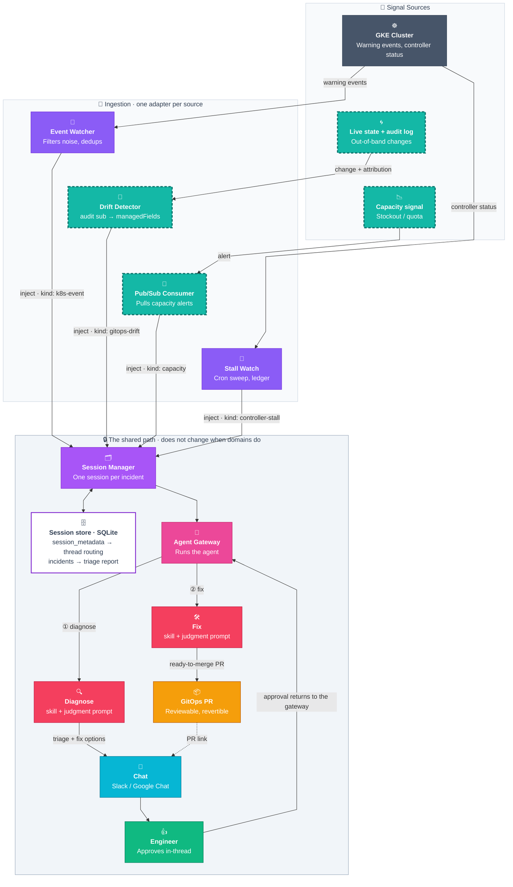

# AutoOps — Architecture

One path from operational signal to GitOps pull request, with a human in the middle.
New domains plug into that path instead of rebuilding it.

AutoOps is not a troubleshooting bot. It is an extension architecture: a fixed pipeline that turns
_something happened_ into _someone approved a reviewable change_, plus a small set of contracts that
a new operational domain implements to ride that pipeline. Incident triage is the first domain on it,
not the product.



> **Legend:** solid = live today · dashed teal = what a new domain supplies (its source and its adapter).
> Everything inside the shaded band already ships. Judgment sits inside the band but is _parameterized_
> per domain — see [Contract 3](#contract-3--judgment).
>
> **① and ② are two turns of one session, not one call.** Each turn is an agentic loop — the agent
> iterates over tools until it has an answer — and the second turn only starts when an engineer approves
> in-thread, which routes back through the gateway. The session store is what makes the gap survivable:
> `incidents` holds the triage report and its fix options, so a reply of _"apply Option B"_ hours later
> still resolves. The Session Manager is ours (`session_kv_server.py`, SQLite-backed); the Agent Gateway
> is the Hermes REST endpoint it calls to run each turn.
>
> On the event-triage path the row is written by the delivery itself: the kanban notifier posts the
> completed card's report into the thread and keys it to that thread in the same step
> (`deploy/docker/patches/kanban_notifier.py`). It decides from the report rather than from the card —
> a `What to do` heading with either a lettered option or the `To authorize:` call to action under it —
> because nothing in the subscription row still says the card came from event triage by the time the
> notifier reads it.

## What qualifies as a domain

The pipeline handles one shape of problem:

1. **A signal arrives** — something changed, broke, or crossed a line.
2. **Someone has to judge it** — the right answer needs context a static rule can't hold, and reasonable
   engineers could disagree.
3. **The fix lands as a reviewed change** — a pull request a human approves, not a mutation on a live cluster.

If step 2 is a lookup table, use a policy engine. If step 1 never fires on its own, there is nothing to
react to.

**Day 2 is the scope.** This pipeline reacts to what a running fleet does. Day 0 authoring and
provisioning — writing blueprints, standing up clusters, laying down a mesh — is a different product
surface, and deliberately not this one.

## The platform is five contracts

A domain plugs in by satisfying five contracts. Four of them are already implemented and shared; the
fifth (judgment) is shared machinery with per-domain content.

| #   | Contract            | What it settles                                           |
| --- | ------------------- | --------------------------------------------------------- |
| 1   | **Ingestion**       | How a signal becomes an inject on the pipeline            |
| 2   | **Session & state** | What "one incident" means, and what is remembered         |
| 3   | **Judgment**        | What the agent is asked to decide, and how it must answer |
| 4   | **Context reach**   | What the agent can actually read                          |
| 5   | **Remediation**     | How a decision becomes a change                           |

---

### Contract 1 · Ingestion

**One adapter per source.**

The adapter owns everything source-specific: authentication, payload parsing, noise thresholds,
and deduplication. The `kind` field is the discriminator skills match on, so a second source ships
a different constant rather than a different path.

The Go event watcher marshals an `InjectPayload`, wraps it as `{"message": "<escaped JSON>"}`, and
`POST`s it to `/sessions/{id}/inject` (`k8s-operator/cmd/k8s-event-watcher/injector.go`). The watcher
sends **no prompt** — it sends facts. Noise control lives here too: namespace allow/deny rules, a
flapping guard, and a 24h dedup window keyed on `EventKey{UID, Reason}`, so a crashlooping pod is one
incident rather than forty.

**A new domain supplies:** an adapter that detects its signal, filters its own noise, and emits the
inject envelope with its own `kind`.

> **Honest state:** the event envelope is still k8s-shaped — `reason`, `namespace`, `kind_of_object`,
> `name`, `message`. The second source did not generalize it; it landed alongside it. The drift
> detector sends its own `kind: gitops-drift` envelope with its own fields, and the inject route
> dispatches on `kind` rather than reconciling the two. So the pattern a third domain now follows is
> "add a kind and a branch", which works and does not scale — a shared envelope is still owed, and is
> now a refactor of the producers rather than a design decision about one: the stall watch added a
> kind and a branch too.

---

### Contract 2 · Session & state

**One session per incident, held in two tables**
(`agents/platform/scripts/session_kv_server.py`):

```sql
CREATE TABLE session_metadata (        CREATE TABLE incidents (
  session_id TEXT PRIMARY KEY,           chat_id    TEXT NOT NULL,
  metadata   TEXT NOT NULL,              thread_id  TEXT NOT NULL,
  updated_at TIMESTAMP                   report     TEXT NOT NULL,
);                                       created_at TIMESTAMP,
                                         PRIMARY KEY (chat_id, thread_id)
                                       );
```

**`session_metadata`** maps a session to its chat thread, so a reply in that thread routes back to the
same session instead of starting a new one.

**`incidents`** keeps the first triage report per thread — the one carrying the proposed fix.

This is what makes follow-up work: an engineer replies _"apply Option B"_ hours later, and the agent still
knows what Option B was. Three paths write it: the cron report relay, in-process; `send_notification`, when
a Platform Agent posts into a thread; and the kanban notifier, when it delivers a card whose result carries
a fix a reply could authorise into one. Only the last of those is on the event-triage path, and it is the only one
that gates on the report's shape rather than on where the write came from — the notifier cannot tell an
event-triage card from an ordinary one by the time it runs, so the artifact is the test.

The two remote writers go through `POST /v1/incidents`, which is `INSERT OR IGNORE`: later chatter in the
thread cannot overwrite the decision record. The relay writes in-process (`_store_incident_report`) and
replaces, so each run of a cron job updates the row for the thread it keeps posting into rather than being
ignored after the first. Both tables expire on a TTL sweep
(`SESSION_KV_CLEANUP_TTL_DAYS`, default 14).

**A new domain supplies:** nothing. It inherits sessions and thread routing for free, and follow-up as far
as its delivery path writes an `incidents` row.

#### What it unlocks — every incident leaves a written report behind

The `incidents` table is already an incident corpus in embryo — every triage the fleet has produced,
in one place:

- **A postmortem draft**, written from the triage and the approved fix, not from memory a week later.
- **Recurrence matching** — match a new incident against past ones and surface the fix that actually worked.
- **Fleet failure patterns** — what breaks, where, and how often. A reliability review built from real incidents.
- **An eval set** — past reports plus what humans approved is a labelled set for scoring the agent.

None of this is built yet. Resource keys, a captured outcome, and retention past the TTL are what turn
that table into a corpus, and they are small changes to a table we already write.

---

### Contract 3 · Judgment

**Every domain writes its judgment prompt.**

The watcher sends JSON. `session_kv_server.py` turns it into one string, and that string decides how
the whole interaction behaves. Every new domain writes one of these, next to its skill.

It is two strings, in fact, because the reader of the first is not the agent that does the work.
`_create_gateway_session` cannot choose a profile — Hermes selects one by URL prefix under
`gateway.multiplex_profiles`, which is off, and a `profile` key in the body is accepted and dropped —
so the turn always lands on the front door. `_build_agent_query()` therefore addresses a router:
one `kanban_create` to the `cluster-*` agent scoped to the event's cluster, with the diagnostic brief
copied between two markers **verbatim**, and nothing else — no diagnosis, no posting, no second card
asking someone else to answer. That last clause is not hypothetical tidiness; a front door handed the
brief as instructions rather than as cargo summarised it, dropped the delivery instruction, and filed
extra cards to have other agents deliver the report.

`_triage_task_body()` builds what travels between the markers, and it is the string above's real
payload. Abridged, as it runs today:

```
Analyze the following Kubernetes event warning on GKE cluster '{cluster}'.

**Event Details:**
• *Resource:* {namespace}/{kind}/{name}
• *Event Reason:* {reason}
• *Warning Message:* {message}

**Finish by calling `kanban_complete(result=<your full report>, summary=<one line>)`.**
Pass the entire report as `result`, not a summary of it: this card is subscribed to the chat
thread where the alert was raised, and `result` is what gets posted there ...

**Do this yourself. Do not delegate the diagnosis to another agent, and do not open child cards
for it** — ... the report has to be this card's own result to be delivered.

Format the report you pass to `kanban_complete`'s `result` exactly like this — these three
`##` sections are the only ones, and there is no fourth:

## What's wrong
<1-sentence description of the problem>

## Why
- <key constraint mismatch or log finding, with the evidence that proves it>

## What to do
- **Option A (<Action Title>):** <1-sentence GitOps fix>
- **Option B (<Action Title>):** <1-sentence GitOps fix>
- ✅ **Recommended: Option <letter>** — <why this is the safer choice>
- **To authorize:** reply **'apply'** to open a GitOps Pull Request with the recommended fix,
  or name one directly with **'apply Option A'** / **'apply Option B'**.

The prompt says separately that with exactly one option the section is unlettered instead — a
lettered label asks the reader to pick from a list of one — so that `What to do` reads:

## What to do
- **Proposed fix (<Action Title>):** <1-sentence GitOps fix>
- **To authorize:** reply **'apply'** to open a GitOps Pull Request with this fix.

**Who acts on this:**
A human reads your options and the agent that holds the GitOps write path opens the Pull
Request ... the fix ships as a Pull Request against the GitOps repository, and nothing is
written to the live cluster directly.
```

**What that one string pins down** — four design decisions, not formatting preferences:

- **The delivery** — completing the card _is_ the delivery. Hermes subscribes every card to the session
  it was filed from and posts a terminal card's `result` to that chat thread, so the prompt asks for one
  terminal call and insists the whole report goes in `result` rather than a summary of it. It also
  forbids delegating the diagnosis, because only this card carries the subscription: a child card's
  result is delivered nowhere. What made this fail was the address, not the mechanism — an event-triage
  turn arrives over the REST gateway, which stamps the subscription with `platform="api_server"`, and
  the row was written well-formed and undeliverable. Issue #630, closed in the image by
  `deploy/docker/patches/kanban_event_routing.py`.
- **The report shape** — a fixed layout the reader learns once. Consistency across domains is what makes
  the output skimmable at 3am. It is not an independent choice: "formatted exactly like this" outranks
  the persona, so a shape here that disagrees with the Platform Agent's SOUL.md §7 does not extend that
  policy, it silently replaces it. A new domain's template starts from §7's three sections. The template
  spells that shape out rather than citing the section, because the agent reading it is a Cluster Agent,
  whose persona has no §7.
- **The approval interaction** — the exact words that turn a suggestion into an authorized action. The
  template ends with `To authorize: reply 'apply'`, and the bullet is load-bearing on the row behind it:
  the agent acting on such a reply reads the report back from `incidents` through the `incident_context`
  plugin. Between #738 and #802 nothing wrote that row — the card delivery had replaced
  `send_notification`, the table's only writer — and a reply arrived at the front door as a bare `apply`
  with no report and no options, so the bullet was withheld. The notifier now writes it as part of the
  delivery. That write is best-effort by design — an exception on the delivery path would rewind the
  notifier's cursor and re-post a report the user has already read — so the promise in the bullet is
  unconditional while the row behind it is not. A delivery that could not store its row logs a warning
  naming the card and the thread, and that log line is the only thing distinguishing "the row was never
  written" from "the user replied in the wrong thread". The prompt also tells the agent that this
  bullet is the call to action rather than another
  option, because it sits in the same list as Option A and Option B and gets numbered alongside them
  otherwise. The bullet carries a second job on the single-option shape: with no lettered option
  under the heading, it is what `kanban_notifier.actionable_report` recognises a report by, so
  reword it and those reports stop earning the row they invite a reply to.
- **The write boundary** — the fix ships as a Pull Request; nothing is written to the live cluster. The
  triaging agent does not open that PR itself — the reply arrives as chat ingress on the front door, and
  the agent holding the GitOps write path acts on it — which is why the prompt asks for options named
  precisely enough to act on from the report alone. This is the safety property of the whole
  architecture, and it is stated in the prompt.

A domain also registers a **skill** ([Plugging in a new domain](#plugging-in-a-new-domain) says where), which supplies the
diagnostic procedure — e.g. `gke-workload-troubleshooting` walks pod status → namespace events →
container logs → service and NetworkPolicy checks → propose a GitOps correction. The persona that runs
the triage requires the agent to query the catalog and load the matching domain skill before diagnosing
(Cluster Agent `SOUL.md` §3) and to pass a pre-report self-audit demanding quoted command output,
resource names, and UTC timestamps (§4). The communication policy on the result — the three-part layout
and a jargon translation table (`OOMKilled` → "the application ran out of allocated memory") — is
Platform Agent `SOUL.md` §7, which the prompt template above mirrors.

**So a new domain supplies two things: a skill and a judgment prompt.** The skill is _how to investigate_;
the prompt is _what to decide and how to say it_.

> **Honest state:** this is what the second domain actually cost. `_build_agent_query()` is hardcoded
> k8s-event-shaped, so drift got a second query builder and a second card body rather than a plugged-in
> prompt, dispatched on `kind` at the top of the function. Making it pluggable is still the same piece
> of work as generalizing the envelope. The stall watch added its own builder and body the same way,
> so there are several implementations to fold in rather than one to parameterize.

---

### Contract 4 · Context reach

**Judgment is capped by what the tools can see.**

The agent can only connect domains its tools can read. Every tool added widens the set of answerable
questions, with no pipeline change.

| Surface                                                      | Reaches                                                | Status    |
| ------------------------------------------------------------ | ------------------------------------------------------ | --------- |
| `kubectl` / `gcloud` via `platform_control` + hosted GKE MCP | k8s events, pod state, logs, RBAC, networking, storage | **Wired** |
| Prometheus / PromQL MCP                                      | Metric values, saturation, scale-up pressure           | Future    |
| Quota inspection                                             | Compute, IP space, `SSD_TOTAL_GB` and friends          | Future    |
| Runbook / knowledge retrieval                                | Team-specific procedure and history                    | Future    |

Two MCP servers are configured in `agents/platform/config.yaml`: `platform_control` (local) and the
hosted `gke` endpoint. Adding a tool is additive and requires no pipeline change — but until a tool
exists, the journeys that depend on it are out of reach, and saying otherwise on a slide is how
architectures lose credibility.

**A new domain supplies:** whatever tools its judgment needs that are not already wired.

---

### Contract 5 · Remediation

**One safe write path for every domain.**

Every domain ends in the same place: a pull request. Not a mutation, not an auto-heal, not a direct
`kubectl apply`. The agent proposes, an engineer approves in-thread, and the change lands as a branch,
a diff, and a PR link posted back to the same thread.

This is why the write boundary is stated in the prompt rather than only enforced in tooling — the model
is told the rule in the same breath it is told the task. Because remediation is a pull request rather
than a live write, a new domain inherits reviewability and rollback for free.

**A new domain supplies:** nothing, unless it needs a different target (Terraform, a runbook execution)
— in which case that is a new remediation adapter behind the same approval loop.

---

## What ships today — signal to pull request, with a human in the middle

The GKE-events path is live end to end:

- **Detection** — `k8s-event-watcher` streams warning events in real time, with namespace deny/allow
  rules and a flapping guard. The deployed watcher forwards eight reasons, which
  `deploy/shared/start-services.sh` passes as `--reason` and no environment variable overrides:
  `Failed`, `FailedToDrainNode`, `CrashLoopBackOff`, `BackOff`, `ImagePullBackOff`, `ErrImagePull`,
  `OOMKilled`, `FailedScheduling`. The same list admits two more, cluster-autoscaler's
  `TriggeredScaleUp` and `NotTriggerScaleUp`, which the watcher records against the pod and never
  forwards: a `FailedScheduling` is held while a scale-up for its pod is in progress, passed at any
  count once the autoscaler has declined to help, and otherwise held until its fifth repeat, so a
  pod waiting for a node the cluster is already adding opens no card and a pod nothing will place
  opens one. The eleven-entry `defaultReasons` in the watcher's `filter.go` — which does include
  `Evicted` — applies only when `--reason` is left unset, so it does not describe an install.
  `Decide` matches the wire reason exactly and before canonicalization, so a reason absent from
  that list produces nothing at all: no session, no card, no report.
- **Dedup** — a 24h rolling window collapses repeats and related reasons into one incident.
- **Session + routing** — one session per incident, SQLite-backed, posted to the right chat thread and
  recorded with the platform that thread lives on, with the triage report stored for follow-up replies.
  The turn wakes the front door, which delegates the diagnosis as one kanban card to the Cluster Agent
  of the cluster that raised the event.
- **Judgment** — that cluster's Cluster Agent loads the matching skill, diagnoses root cause, and
  completes its card with a plain-language triage carrying as many GitOps fix options as the root cause
  warrants; the card's subscription posts it back into the alert's thread.
- **Human-in-the-loop** — an engineer approves in-thread; nothing reaches production without it.
- **Remediation** — the approved fix ships as a GitOps PR.

The controller-stall path is live on the same spine. `stall-watch`, a cron script on the Platform
Agent's roster, finds controllers that stopped making progress without erroring — a state that
raises no event on the watcher's list — and sends a `controller-stall` inject per namespace with a
new stall. From the session onward it is the path above: the alert, the card to that cluster's
Cluster Agent (which runs `gke-stall-detection`), the triage in the alert's thread, the approval and
the PR ([design](../../../docs/designs/stall-watch-inject.md)).

## Plugging in a new domain

Each new domain adds a source, an adapter, a skill, and a judgment prompt. In order:

1. **A signal** — something that fires on its own.
2. **An adapter** — detects the signal, filters its own noise, emits the inject envelope with a new `kind`.
3. **A skill** — the diagnostic procedure, registered in `agents/cluster/skills/` when a Cluster Agent
   runs it on one cluster (as both live triage paths do), or in `agents/platform/skills/`.
4. **A judgment prompt** — what to decide, what shape the answer takes, what the approval words are.

Sessions, thread routing, follow-up memory, chat delivery, the approval gate, and PR generation are not
on the list. That is the point.

## What else fits this path

Anything with the same shape rides the same pipeline: a signal arrives, someone has to judge it, the
fix lands as a reviewed change. Each of these is an adapter, a skill, and a judgment prompt away.

| Domain                       | The signal                                | State     |
| ---------------------------- | ----------------------------------------- | --------- |
| **Incident triage**          | Warning event on a workload               | **Live**  |
| **Drift detection**          | Out-of-band change in the audit log       | Candidate |
| **Controller stalls**        | Controller stopped without erroring       | **Live**  |
| **Obtainability governance** | Stockout investigator                     | Candidate |
| **Shadow infrastructure**    | Unmanaged resource found in inventory     | Candidate |
| **Policy propagation**       | Policy missing on a cluster in the fleet  | Candidate |
| **Add-on lifecycle**         | Add-on version or health goes out of band | Candidate |

### Domains grow. The pipeline doesn't.

**Drift detection — two contracts touched.** Emits `kind: gitops-drift`. Takes no dependency on any
GitOps tool, so it works on every cluster and covers resources no tool manages. Argo and Flux become
optional enrichment, never a prerequisite. It has a full design doc and a completed attribution spike:
`managedFields` gives field-level ownership, the audit log gives the principal, and the two-signal join
separates a human out-of-band change from CI and from controller churn (~99% noise reduction with two
static filters).

The adapter is now built end to end — ingestion, classification, the `managedFields` join across
every cluster the Platform Agent has onboarded, and the inject itself — and the daemon routes the
kind to its own chat alert and its own triage card. The agent images now carry the detector and the
credential proxy's entrypoint starts it, so what an install still needs is
`spec.harness.driftDetector.enabled` set on its `PlatformAgent` and the `drift-pubsub` Terraform
module applied. Only the first is a start gate: without it the detector ships and does not run,
while enabling it without the module gives a detector that runs and retries a pull that cannot
succeed. Either way no drift is detected. Both are flags:
`terraform/examples/full-install` instantiates the module when `enable_drift_pubsub` is set and
writes the CR field when `enable_drift_detector` is, and it refuses an apply that asks for the
second without the first. Through the installer front doors the pair is one `install.env` key,
`ENABLE_DRIFT_DETECTOR`, which turns on both.

**Obtainability governance — the same two contracts.** A completely different domain, engineered
independently, arrived at the same shape. It also closes the quota and capacity gap that previously
bounded cross-domain troubleshooting.

## The CUJs that make this worth building

Single-domain failures (an OOMKill, a bad image tag) are easy — one engineer, one dashboard, done. The
journeys that hurt are **cross-domain**: the symptom surfaces in one domain but the root cause lives in
another, so the human looking at it can't fix it and a multi-team hand-off begins. That hand-off is
where incident time goes, and it is exactly what one agent, pulling whatever context its tools expose in
a single session, can collapse.

| Symptom (where the human looks)       | Root cause (where the fix is)               | Real example                                                                          |
| ------------------------------------- | ------------------------------------------- | ------------------------------------------------------------------------------------- |
| Pods stuck **Pending** — _Workload_   | **Scheduling** / **capacity / quota**       | Insufficient GPU · untolerated taint · `SSD_TOTAL_GB` quota exceeded on PVC provision |
| **Scale-up failing** — _Scalability_  | **Quota** exhausted in Compute / networking | `scale.up.error.quota.exceeded` · `IP_SPACE_EXHAUSTED`                                |
| **App not starting** — _Workload_     | **Networking** path broken                  | ImagePullBackOff · webhook i/o timeout · "service not ready"                          |
| **Control plane unreachable** — _IAM_ | **Security** credential expiry              | `x509: certificate has expired` on cluster init                                       |
| **App request denied** — _Workload_   | **RBAC** policy                             | `…is forbidden: …authorization.k8s.io`                                                |

Rows grounded in events, logs, RBAC, and networking config are within reach today via `kubectl` /
`gcloud`. The scale-up and capacity rows depend on the metrics and quota gaps in
[Contract 4](#contract-4--context-reach).

## What this architecture enables

> **The differentiator:** turn a _Workload_ symptom into a _Networking_ or _RBAC_ root cause **without a
> human relay race** — the agent correlates symptom domain to cause domain in one session, and each new
> tool widens what it can correlate.

- **One front door, many signals** — every signal becomes an incident on the same path; no per-source runbook.
- **Cross-domain root-cause correlation** — follow the symptom to the real cause across domains.
- **Consistent, safe remediation** — whatever the domain, the fix lands as a reviewable PR behind approval.
- **Coverage that compounds** — each new domain inherits session, memory, chat, approval, and PR for free,
  so the catalog grows without new plumbing.

## Known gaps

Stated plainly, because they scope the next milestone:

- **The inject envelope is k8s-shaped**, and so is `_build_agent_query()`. The drift and stall domains
  each added a kind and a branch beside it rather than generalizing either.
- **No incident corpus yet** — the `incidents` table has the data but not the keys, outcomes, or retention.
- **No metric or quota tooling** — two of the five cross-domain CUJ rows are blocked on it.
- **Judgment has no regression harness** — judgment is the differentiator, so it needs an eval suite.
- **Outbound is chat-only** — the only paths out are the chat thread and the PR link posted into it.
  Nothing acks or resolves the originating signal (a PagerDuty incident, a monitoring alert). A PRD on
  outbound paths is in flight; the shape is a status adapter mirroring the ingestion adapters.

## Related

- [`session_management.md`](session_management.md) — session lifecycle and chat-thread routing in detail
