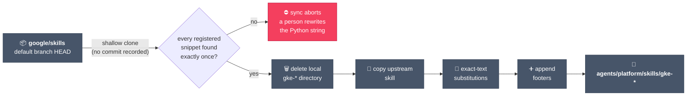
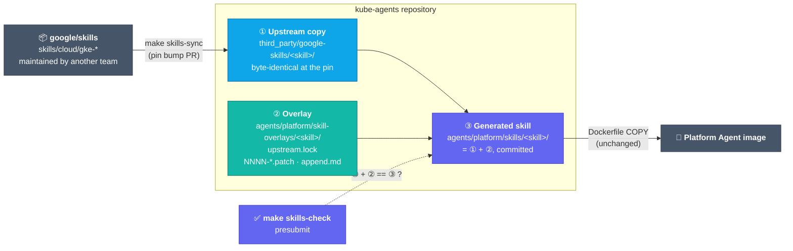
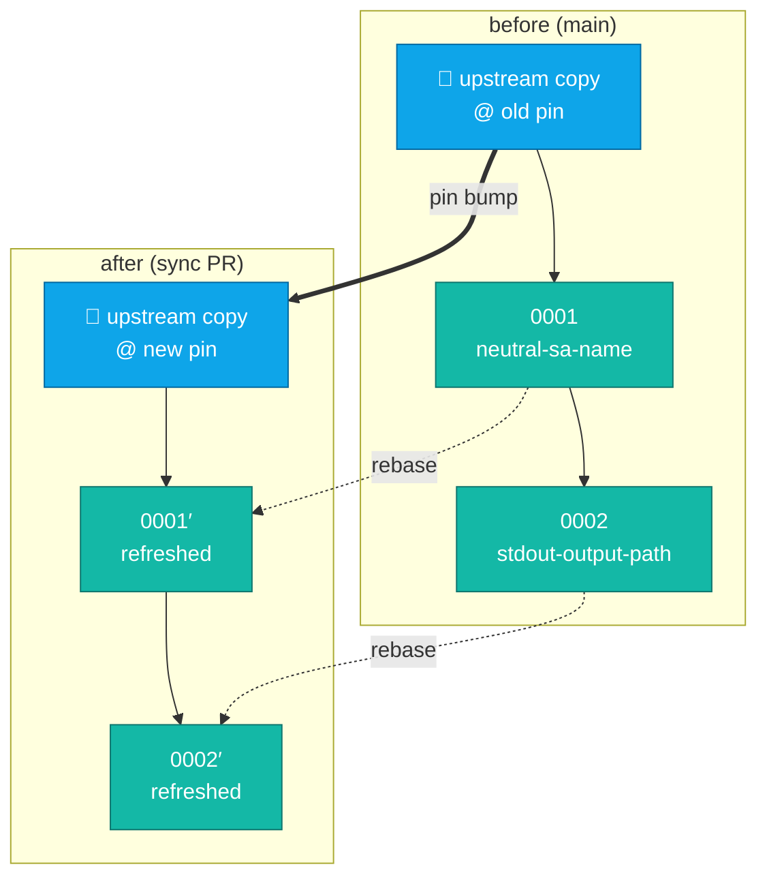
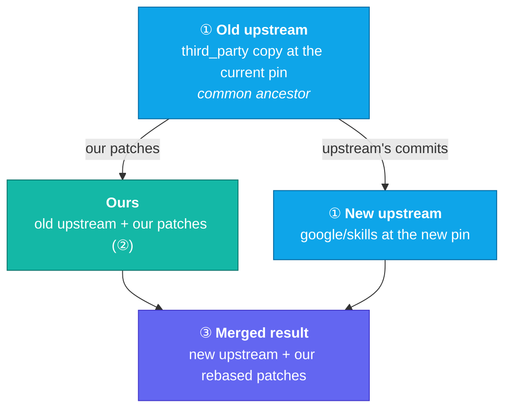
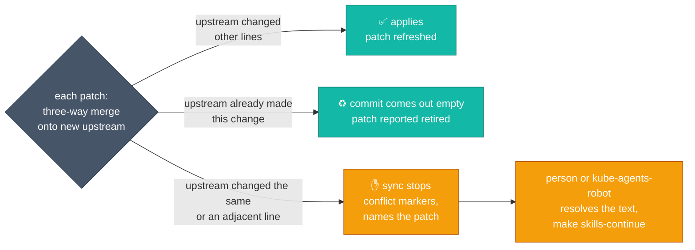
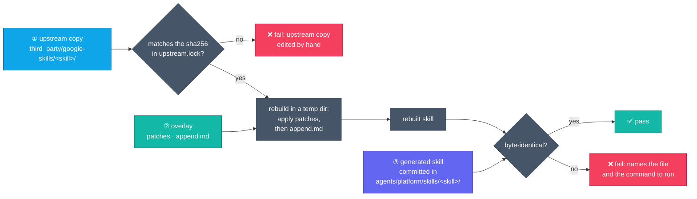
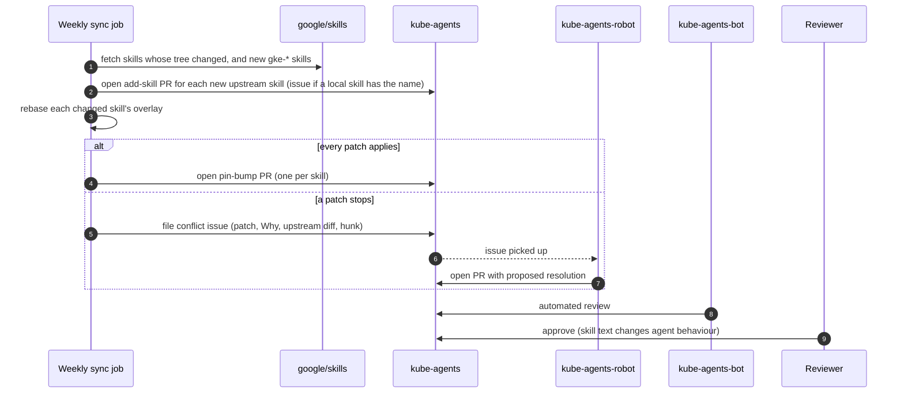

# Upstream skill overlays

> **STATUS — design; not implemented.** `scripts/sync-upstream-skills.py` and its string
> registries are what runs on `main`. The implementation plan is tracked in
> [#2374](https://github.com/gke-labs/kube-agents/issues/2374); the policy questions it answers
> were raised in [#1450](https://github.com/gke-labs/kube-agents/issues/1450).

## Context

| Question   | Answer                                                                                                                                                                                                                    |
| ---------- | ------------------------------------------------------------------------------------------------------------------------------------------------------------------------------------------------------------------------- |
| What       | The 29 `gke-*` skills under `agents/platform/skills/` are copies of `skills/cloud/gke-*` in [`google/skills`](https://github.com/google/skills), the repository `scripts/sync-upstream-skills.py` syncs from.             |
| Constraint | Another team maintains `google/skills`; it accepts issues but no external pull requests. Our changes (credential proxy, `$HERMES_HOME`, routing to our own skills, persona rules) live here for as long as the skills do. |

## What happens today

The sync script shallow-clones upstream's default branch, deletes each local `gke-*` directory,
copies the upstream one over it, then re-applies our changes from Python string constants.
F1, F5 and F6 below are visible in the picture; the rest are what the script lacks.



| #   | Fault                             | Effect                                                                                                                                                                                                                                                                                                                                                                              |
| --- | --------------------------------- | ----------------------------------------------------------------------------------------------------------------------------------------------------------------------------------------------------------------------------------------------------------------------------------------------------------------------------------------------------------------------------------- |
| F1  | No upstream commit recorded       | Each change is found by exact text, not line numbers, and the plain upstream text is discarded after the sync. The stored old snippet is the only trace of the common ancestor, so any upstream edit inside it — even to lines we kept — stops the sync until a person rewrites the Python string. Nor does the repo record, or let anyone verify, which upstream version it ships. |
| F2  | Changes live in the script        | About 240 of the script's 754 lines are skill text, away from the skills they change. Substitutions edit `SKILL.md` only, and each new kind of edit has needed a new registry (`SKILL_SUBSTITUTIONS`, `SKILL_FOOTERS`; open PR #2357 adds a third, `SKILL_FILE_SUBSTITUTIONS`, and #2353 is stacked on it).                                                                         |
| F3  | One shared file                   | Every local change and most syncs edit the script, so parallel skill PRs conflict there.                                                                                                                                                                                                                                                                                            |
| F4  | Unregistered edits are not caught | Tests check each registered substitution and one of the five footers. A direct edit to a mirrored file passes review and is lost on the next sync.                                                                                                                                                                                                                                  |
| F5  | Upstream adoption is mishandled   | An adopted substitution is skipped silently and stays in the script forever; an adopted footer is appended a second time (only its marker is checked).                                                                                                                                                                                                                              |
| F6  | Prune by name                     | Any local `gke-*` directory upstream lacks is deleted on the next sync, so a skill we write with that prefix is lost.                                                                                                                                                                                                                                                               |
| F7  | Manual, all-at-once sync          | One run refreshes every skill from `HEAD`, and nothing schedules it, so new upstream skills arrive only when someone runs it. One drifted snippet aborts the whole run, for every skill, and the error goes only to the runner's terminal: no issue, no notification.                                                                                                               |

As of 2026-10-05, every stored snippet still matches upstream's latest version: the upstream edits since the last sync were all outside them. F1 is about the next edit inside a snippet, not a current breakage.

## Proposed design



[What this design addresses](#what-this-design-addresses) maps each fault to its fix.

### The three layers

| Layer             | Path                                      | Contents                                                         | Changed by                                                              |
| ----------------- | ----------------------------------------- | ---------------------------------------------------------------- | ----------------------------------------------------------------------- |
| ① Upstream copy   | `third_party/google-skills/<skill>/`      | `skills/cloud/<skill>/` byte-identical at the pinned commit      | The sync; a person only to move or remove it                            |
| ② Overlay         | `agents/platform/skill-overlays/<skill>/` | `upstream.lock`, `NNNN-<slug>.patch` files, optional `append.md` | Contributors (patches, `append.md`); the sync (lock, refreshed patches) |
| ③ Generated skill | `agents/platform/skills/<skill>/`         | ① with ② applied; committed                                      | Contributors directly; `make skills-generate`; the sync                 |

- **Upstream copy:** outside `agents/platform/skills/`, so the image build, catalogue generator and skill command check never see it.
  - Keeps today's `.prettierignore` and `make shellcheck` exclusions; `docs/README.md` gains inventory rows for it and for `append.md`.
  - A sync PR shows upstream's change as a diff of this directory.
- **`upstream.lock`:** two values, rewritten by the sync in the PR that replaces the copy, so copy and lock match unless the copy was edited by hand. One per skill, so per-skill PRs share no file.

  | Value    | Main job                                                                                                                                                                                                                                                                                                                                                                                         |
  | -------- | ------------------------------------------------------------------------------------------------------------------------------------------------------------------------------------------------------------------------------------------------------------------------------------------------------------------------------------------------------------------------------------------------ |
  | `sha256` | Content check: does `third_party/google-skills/<skill>/` still match what we pinned? Catches hand edits, offline, on every PR.                                                                                                                                                                                                                                                                   |
  | `commit` | Which upstream version we ship. `make skills-status` and the notice in `refresh` compare `skills/cloud/<skill>/` at upstream's latest commit with the same folder at this commit, not the two commit IDs (upstream's head moves when any skill changes), to tell whether there is anything to sync. It is also the rebase's starting point and what the comparison with `google/skills` fetches. |

- **Mirrored list:** a skill is mirrored if its overlay has a lock (the overlay may hold only the lock).
  - When upstream drops or renames a skill, the sync reports it and a person moves or removes the copy, overlay and lock.
- **Patches:** one change per file in `git format-patch` form, without commit hashes, `index` lines or a diffstat, so a refresh changes only hunk headers and moved lines. A patch can touch any file in the skill or add one. Example header below.
- **One patch per reason:** follow-up edits fold into the existing patch, so the count tracks reasons: today's registries become seven patches across four skills (at most four in one) plus five `append.md` files.
- **When to stop mirroring:** a person's decision, not a CI rule. Patch count alone is not a signal: several small patches over a small part of a skill still leave the rest getting upstream's updates.
  - Review a skill when its patches rewrite most of it, when most of its syncs conflict, or when upstream keeps moving it away from what we need.
  - To stop: delete its copy, lock and overlay; the generated skill becomes ours.
- **`append.md`:** what `SKILL_FOOTERS` appends today. Applied after the patches rather than as one, because git treats an edit to upstream's last lines as adjacent to anything appended below them.
- **Generated skill:** stays where skills are today and stays committed, so reviewers, `grep`, the bench tasks and the Dockerfile read it. Contributors edit it like any other file; the presubmit fails on an edit no patch records.

Patch header example:

```diff
Subject: Open a pull request in Step 5 only when the request asked for the fix

Why: the platform persona proposes a fix in its reply unless asked to
submit it (SOUL.md §3, item 3); upstream opens a PR on every crashloop walk.
Local-Issue: #2037
Upstream-Issue: none (specific to this repository)
Retire-When: never; the persona rule is ours

--- a/SKILL.md
+++ b/SKILL.md
@@ -224,8 +224,12 @@
 ...
-3.  Check if a branch or Pull Request (PR) already exists for this
-    workload/failure. If so, update the existing branch/PR or notify the user
+3.  If the request asked for the fix to be submitted or applied ("fix it",
+    "open a PR", a card whose task says so), check whether a branch or Pull
 ...
```

### Patch order

How it works:

- Patches apply in filename order (`0001-…`, `0002-…`); every patch file in the overlay is applied.
- Each patch is recorded on top of all earlier ones: `make skills-refresh` diffs the edit against upstream plus every existing patch.
- The tool names a new patch with the next free number and a slug from its subject; deleting a patch's file removes it.

Why order rarely matters:

- Patches that change separate parts of a file give the same result in any order.
- "Separate" means neither patch changes a line within the other's three lines of context.
- Duplicate numbers are allowed: two PRs can both add a `0003-…` patch, and the slug keeps the files apart and breaks the tie.
- A wrong order cannot ship: a patch placed before one it builds on no longer applies, and `make skills-check` fails.

When parallel PRs on one skill conflict:

| The two PRs change               | What happens                                                              | Fix                                                   |
| -------------------------------- | ------------------------------------------------------------------------- | ----------------------------------------------------- |
| Separate parts of the skill      | Both merge; they share no file                                            | None                                                  |
| The same or adjacent lines       | GitHub reports a conflict on the second PR                                | Rebase, settle the wording, run `make skills-refresh` |
| Lines within three of each other | Both can merge green; `validate` on `main` then fails and names the patch | A follow-up PR runs `make skills-refresh`             |

- Each fix is one command once the wording is settled.
- The third case is caught after merge because `validate` does not rerun on an open PR when `main` moves; a merge queue would catch it before merge (`validate` already runs on `merge_group`).

### Syncing a skill

Syncing is manual and per skill; each sync goes in its own PR.

| Command                              | Does                                                                                                                                |
| ------------------------------------ | ----------------------------------------------------------------------------------------------------------------------------------- |
| `make skills-sync SKILL=<skill>`     | Moves one skill to upstream's latest version (or `REF=<commit>`), rebasing its patches                                              |
| `make skills-sync SKILL=<new-skill>` | Adopts a new upstream skill: copy, lock, empty overlay and generated skill. Refuses if a skill without a lock already has that name |
| `make skills-status`                 | Lists mirrored skills whose upstream folder changed since their pin, and upstream `gke-*` skills not yet mirrored                   |
| `make skills-continue SKILL=<skill>` | Resumes a sync that stopped on a conflict                                                                                           |

How a sync works, in a scratch repository so the working tree changes only when the result is ready:

1. Commit the old upstream copy, then each patch on top of it, in filename order, as its own commit.
2. Commit the new upstream copy on a separate branch from the same root.
3. Rebase the patch commits onto the new upstream copy with `git rebase --empty=drop`.
4. Write the new upstream copy and `upstream.lock`, re-export the surviving commits as the patch files, and regenerate the skill.
5. Report each patch dropped as empty (retired), and each `append.md` whose text the new upstream copy already contains, for a person to delete. The sync PR lists retired patches with their `Why:`, so a reviewer sees what upstream adopted and can restore a patch from history if upstream later reverts it; a retired patch whose `Retire-When:` says never deserves a second look.

- The scratch repository lives in a git-ignored `.skill-sync/<skill>/` until the sync finishes. The sync goes one patch at a time, like a git rebase: when a patch stops, the person running the sync fixes the conflicted text there and runs `make skills-continue SKILL=<skill>`, which rewrites that patch in place (same file, number and `Why:`) and moves on to the next.
- A patch is deleted only when upstream adopted it exactly (retired automatically) or the person resolving a conflict decides upstream's new version makes it unnecessary.
- The sync prints, for its PR description, the number of patches, the share of the skill's lines they change, and how many recent syncs conflicted. It is information for the stop-mirroring decision and blocks nothing.



Each patch is merged three ways. The old upstream copy is the common ancestor; ours and the new upstream both start from it, and the merge brings them back together:



The ancestor is what lets git tell which side changed a line. Today's script has only ours and the new upstream, so any difference inside a snippet stops it. Each patch ends one of three ways:



"Other lines" means at least one unchanged line separates upstream's edit from the lines a patch changes. An edit on a patched line, or on the line right next to it, stops the sync; anything further away merges. A patched file that upstream renames is followed to its new name, and one that upstream deletes stops the sync. These rules were checked with git 2.56.

- A stop is a real merge conflict: upstream and we rewrote the same passage, and only someone who knows both intents can write the merged text.
- Any automatic rule would pick a side and silently drop either our correction or upstream's improvement, so the decision stays with a person and everything around it is automated.
- An AI assistant can propose the resolution: it reads the stopped patch's `Why:` header, upstream's change and the conflicting lines, and suggests the merged text, which a person reviews and commits as the patch's new content. The patch stays a plain diff; AI helps only at conflict time.
- Every sync PR comes with an eval-driven development record (`.agents/rules/eval_driven_development.md`): a case that fails on `main` for the reason the sync addresses, then passes three times with the sync, registered in the nightly roster. See [Eval evidence for syncs and patches](#eval-evidence-for-syncs-and-patches).
- Upstreaming shrinks the work: a general fix (the NetworkPolicy two-step, the `answer_query` quota) is filed as a `google/skills` issue and recorded in `Upstream-Issue:`; once upstream carries it, the next sync reports it retired.

### The presubmit check

- `make skills-check` verifies each upstream copy against its lock's checksum, rebuilds each generated skill from ① and ② in a temp directory, and compares the result with ③ byte for byte.
- Reads only committed files: no network, so it cannot fail because GitHub is slow.
- Patches are refreshed on every sync, so the check applies them without merging; a patch that needs a merge to apply is itself a failure.



- The check guarantees every change to a generated skill is recorded in its overlay; the sync guarantees what the overlay records survives an upstream update.
- The `test_repo_*` tests that each assert one registered change are no longer needed: the check covers every byte of every mirrored skill.

### Changing a mirrored skill

| Task                                     | Steps                                                                                                                                                                                                                                                           |
| ---------------------------------------- | --------------------------------------------------------------------------------------------------------------------------------------------------------------------------------------------------------------------------------------------------------------- |
| Make a new change                        | Edit `agents/platform/skills/<skill>/…`; run `make skills-refresh SKILL=<skill>`; fill in the new patch's headers; commit patch and skill, with the eval record below.                                                                                          |
| Adjust an existing change                | Edit the skill; run `make skills-refresh SKILL=<skill> PATCH=<nnnn>` to fold the edit into that patch.                                                                                                                                                          |
| Edit the appended section                | Edit it in the skill; `refresh` writes it back to `append.md`.                                                                                                                                                                                                  |
| Remove a change or edit the overlay      | Delete or edit the patch (or `append.md`); run `make skills-generate SKILL=<skill>`. Offline.                                                                                                                                                                   |
| Change lines an earlier patch introduced | Fold the edit into that patch with `PATCH=<nnnn>`; it is the same reason. `refresh` warns when a new patch changes lines from an earlier one. A new patch stacked on an earlier one still applies, in filename order, but breaks if the earlier one is deleted. |

- `make skills-refresh` rebuilds the skill from ① and ②, compares the edited skill with that rebuild, and writes the difference as the new (or folded) patch.
- The reviewer sees the change to the skill and the patch that records it; the upstream copy does not change.
- A change takes effect when its PR merges and the image is rebuilt, as today. Upstream updates arrive separately, through the sync.

#### Eval evidence for syncs and patches

Every PR that changes what the agent reads from a mirrored skill — a sync or a new or changed patch — carries an eval-driven development record:

| Step     | Requirement                                                                                          |
| -------- | ---------------------------------------------------------------------------------------------------- |
| Red      | A case, new or existing, run against `main` on a dev install, fails for the reason the PR addresses. |
| Green    | The same case passes three times against the PR's build, on the same deterministic check.            |
| Register | A new case goes in `hack/eval/nightly-cases.txt` with an owner and a domain.                         |
| Record   | The PR body names the case, the red run and the three green runs.                                    |

- Exempt: PRs that leave every generated skill byte-identical, such as the four migration PRs below; the PR states it in one line.
- Most mirrored skills have no case of their own today, so the first sync or patch for a skill usually adds one; later changes to the skill can reuse it when it is red for their reason.
- `refresh` notes when upstream has changed the skill since its pin and suggests running `make skills-sync SKILL=<skill>` in its own commit or PR. It never syncs on its own: an edit and an upstream update stay separate changes, each reviewed and validated on its own.

What `make skills-check` reports when a step is skipped:

| What happened                                                                                  | What the check sees                               | Fix                                                    |
| ---------------------------------------------------------------------------------------------- | ------------------------------------------------- | ------------------------------------------------------ |
| The skill was edited and no patch records the edit                                             | the rebuilt skill differs from the committed one  | `make skills-refresh`                                  |
| A patch or `append.md` was edited and the skill not rebuilt                                    | the rebuilt skill differs from the committed one  | `make skills-generate`                                 |
| The upstream copy was edited by hand                                                           | the copy no longer matches the sha256 in its lock | revert it; sync to change it                           |
| A patch no longer applies (an earlier patch it depends on was deleted, or a hand edit clashes) | the overlay cannot be applied in filename order   | fold or refresh the patch, then `make skills-generate` |

### Skills this repository writes

- Added as today: a directory under `agents/platform/skills/`, with no upstream copy, overlay or lock.
- The sync and the check skip it, whatever its name — including `gke-*`, which today's script would delete (F6).

### Automated edits to a generated skill

- A tool that edits files in place cannot run `make skills-refresh`, so its edit fails the check.
- One does so today: Dependabot's `docker` entry in `.github/dependabot.yml` bumps `agents/platform/skills/gke-app-onboarding/assets/Dockerfile` (now `FROM node:26-slim`; upstream has `FROM node:22-slim`).
- No registry entry records the difference, so the next run of today's script would put upstream's pin back.
- Migration records the pin as a patch (its `Why:` says why we run a newer base image), removes the Dependabot entry for that directory, and bumps the image from then on by changing the patch.
- Any other in-place tool pointed at a mirrored skill gets the same treatment.

## Security guardrails

GitHub cannot make a directory read-only, so the design adds these checks, as steps in the required `validate` job.

| Scenario                                                               | Guardrail                                                                                                                                                                                   |
| ---------------------------------------------------------------------- | ------------------------------------------------------------------------------------------------------------------------------------------------------------------------------------------- |
| Two concurrent, unrelated changes to one skill                         | No shared file: patches in filename order, one lock per skill. Same-line edits conflict in git; nearby edits fail `validate` on `main` after merge (a merge queue would catch them before). |
| Direct edit to a generated skill with no patch                         | `make skills-check` fails: the rebuilt skill (① + ②) differs from ③.                                                                                                                        |
| Hand edit to the upstream copy                                         | `make skills-check` fails: the copy no longer matches the sha256 in `upstream.lock`.                                                                                                        |
| Hand edit to the copy and the lock, or a pin to a fork-only commit     | The upstream comparison fails: the copy differs from `google/skills` at that commit, or the commit is not on upstream's default branch.                                                     |
| No record of which upstream version ships (conformance requirement C4) | Commit and sha256 in every lock; every pin bump is a reviewed PR.                                                                                                                           |
| A tool edits a generated skill in place (Dependabot)                   | Its entry is removed and the pin becomes a patch; `make skills-check` fails any other such tool.                                                                                            |
| Adopting an upstream skill whose name a local skill uses               | `make skills-sync` refuses.                                                                                                                                                                 |

### Where the checks run

| Check                           | Runs as              | Runs on                                                                                         |
| ------------------------------- | -------------------- | ----------------------------------------------------------------------------------------------- |
| `make skills-check`             | A step in `validate` | Every PR, offline                                                                               |
| Comparison with `google/skills` | A step in `validate` | Every PR; skips itself unless the PR changes `third_party/google-skills/` or an `upstream.lock` |

- `validate` is already required, so its steps block merge from day one; a new job would need an admin to make it required.
- The comparison skips itself rather than using a workflow path filter, because a required check that never starts blocks every PR.

Optional, not part of this design: an `OWNERS` file on `third_party/google-skills/` with a dedicated approver alias and `no_parent_owners`, so that only named people can approve a sync. The checks above already guarantee the copy is what upstream published; this would only decide who reviews which upstream versions we adopt, at the cost of a second approver on every sync PR.

## Alternatives considered

| Approach                                                                        | Why not                                                                                                                                                                                                                                                                                                                                                                                                                                                |
| ------------------------------------------------------------------------------- | ------------------------------------------------------------------------------------------------------------------------------------------------------------------------------------------------------------------------------------------------------------------------------------------------------------------------------------------------------------------------------------------------------------------------------------------------------ |
| Keep the string registries                                                      | F1–F7 stay.                                                                                                                                                                                                                                                                                                                                                                                                                                            |
| Smarter matching on the stored snippets (fuzzy search plus a per-snippet merge) | Fixes small upstream edits inside a snippet, but only at registered snippets: footers, reference files and unregistered edits have no ancestor, so F4 stays, and no upstream version is recorded. Needs a custom fuzzy matcher that can pick the wrong passage in skills with repeated wording.                                                                                                                                                        |
| A `series` file listing patches in order, as `quilt` does                       | Every new patch is added on its last line, so two PRs that each add a patch to one skill conflict even when their changes are unrelated, and Tide cannot merge until someone rebases (GitHub ignores git's `union` merge mode). It does allow switching a patch off without deleting it, and its forced rebase re-runs CI on the merged result.                                                                                                        |
| Vendor branch or `git subtree` merges into main                                 | Real merges, but main is squash-merged, which loses the merge base a subtree merge needs; nothing records why each change exists; "what do we change" needs a diff against upstream.                                                                                                                                                                                                                                                                   |
| Git submodule pinning `google/skills`                                           | Only replaces the pinned copy: it pins the whole repository at one commit, so syncing skills separately would take one full upstream clone per skill; our changes still need a fork of upstream or patches applied on top (this design with a submodule instead of the committed copy); a sync PR shows a commit-ID bump with a compare link instead of upstream's changes inline; and every checkout, CI job and image build has to fetch submodules. |
| Heading-keyed overlays (Kustomize-like)                                         | Markdown has no schema: list items, fenced blocks and frontmatter scalars, which current changes edit, are not addressable by heading, so it falls back to text matching.                                                                                                                                                                                                                                                                              |
| Whole-file override with an upstream-hash alarm                                 | Simple, but forks the whole file; every upstream change to it is a manual re-merge.                                                                                                                                                                                                                                                                                                                                                                    |
| Runtime composition (companion skill or persona)                                | Leaves upstream untouched, but the model holds two instructions that disagree; the registry already prefers substitutions over footers for those cases; a companion cannot change the frontmatter `description` the router selects on.                                                                                                                                                                                                                 |
| `git apply --3way` per patch                                                    | Merges only when the patch records the blob it was made against; for later patches that blob has to be rebuilt by replaying the series, which is a rebase without dropping adopted patches or resuming after a conflict.                                                                                                                                                                                                                               |
| Copybara with `patch.apply`                                                     | Google's standard tool for this, but it brings a Java toolchain and Starlark config into CI for about 30 directories. The layout here can move to it later.                                                                                                                                                                                                                                                                                            |
| Patches as AI prompts, with a model regenerating each change on every sync      | Less brittle wording, but not repeatable: `make skills-check` cannot compare byte for byte, the shipped text can drift with a model change and no PR, every regeneration is an agent-behaviour change needing eval evidence, a conflict is resolved by silently picking a side, and running a model over upstream text on each build adds a prompt-injection path. The `Why:` header keeps the intent in prose for an AI-proposed resolution instead.  |

## Costs

- Two copies of each mirrored skill (about 440 KiB for 29 skills).
- A new script with six subcommands (`sync`, `continue`, `refresh`, `generate`, `check`, `status`) and its tests.
- Patch files are awkward to edit by hand, hence `make skills-refresh`; a sync PR carries refreshed patches alongside the upstream and generated diffs.
- Migration rewrites the script the open skill-sync PRs edit, so it lands after them.

## Rollout and estimated effort

Four PRs implement the design: about four days for one engineer working with a coding agent. None changes what the agent sees, since every migrated skill stays byte-identical to `main`, so none needs the eval loop; live validation is the byte-identical proof plus a spot check of a skill file in the agent pod. Each PR still runs the presubmit smoke test (1.5 to 3.5 hours per push), which is waiting time.

| PR  | Delivers                                                                                                                                                                                                                                            | Depends on  | Days |
| --- | --------------------------------------------------------------------------------------------------------------------------------------------------------------------------------------------------------------------------------------------------- | ----------- | ---- |
| 1   | `scripts/skill_overlay.py` (`sync`, `continue`, `refresh`, `generate`, `check`, `status`), the lock format, make targets and tests. No skill migrated.                                                                                              | this design | 1–2  |
| 2   | Pilot: `gke-workload-troubleshooting` migrated (copy, lock, one patch); `third_party/google-skills/` with docs-map rows and exclusions; `make skills-check` and the upstream comparison as steps in `validate`; the old script skips locked skills. | PR 1        | 1    |
| 3   | The other 28 skills migrated: copies, locks, the remaining patches, five `append.md` files, and the in-tree edits no registry records. Generated tree byte-identical to `main`.                                                                     | PR 2        | 1    |
| 4   | Old script, registries and their tests removed; references updated (list below).                                                                                                                                                                    | PR 3        | 0.5  |

- Not in the estimate: the first syncs after migration. They land what upstream has added since the last sync (new skills, two renamed TPU skills), which the agent does see, so each follows the eval loop like any skill change.
- Outside the engineer's control, and worth starting first: landing or pausing the open skill-sync PRs before PR 3.

PR 4 also updates every file that names the old script or its registries:

- `AGENTS.md` Skills Guidelines, which also states that every sync and patch carries the eval record above.
- The `skill_sync` source in `tests/conformance/_harness.py` and its C4 tests, repointed at the new script.
- The `Makefile` shellcheck comment and `.prettierignore`.
- The message in `deploy/docker/check_skill_commands.py`.
- Comments in two bench tasks and `agents/platform/scripts/gke_endpoint.py`.
- The Dependabot `docker` entry for `gke-app-onboarding/assets`, removed ([Automated edits](#automated-edits-to-a-generated-skill)).
- The marker line in the five footers names the old script. Migration keeps it verbatim in `append.md` so the generated tree stays byte-identical; a follow-up rewords it.

## What this design addresses

| #   | Fault                                                               | Addressed                 | How, or what is left                                                                                                                                                                                         | Section                                                         |
| --- | ------------------------------------------------------------------- | ------------------------- | ------------------------------------------------------------------------------------------------------------------------------------------------------------------------------------------------------------ | --------------------------------------------------------------- |
| F1  | No upstream commit recorded, no common ancestor                     | Fully                     | The upstream version is kept in `third_party/` and its commit and sha256 in `upstream.lock`; a sync rebases our patches onto the new copy, so git does a three-way merge.                                    | [Sync](#syncing-a-skill)                                        |
| F2  | Changes live in the script; a new kind of edit needs a new registry | Fully                     | Each change is a patch file next to its skill and covers any file type; the registries and the script go away.                                                                                               | [The three layers](#the-three-layers)                           |
| F3  | One shared file, so parallel PRs conflict                           | Fully, for the skill sync | One overlay and one lock per skill, patches ordered by filename. Left: edits a few lines apart from two PRs are caught on `main` after merge, not before (a merge queue would catch them earlier).           | [Patch order](#patch-order)                                     |
| F4  | Unregistered edits are not caught                                   | Fully                     | `make skills-check` on every PR rebuilds each mirrored skill and fails on any byte no patch records.                                                                                                         | [The presubmit check](#the-presubmit-check)                     |
| F5  | Upstream adoption is mishandled                                     | Mostly                    | An adopted patch is retired automatically. An adopted `append.md` is detected and reported, and a person deletes it.                                                                                         | [Sync](#syncing-a-skill)                                        |
| F6  | Local skills deleted by name                                        | Fully                     | A skill is mirrored because it has a lock, not because of its name; local skills are never touched.                                                                                                          | [Skills this repository writes](#skills-this-repository-writes) |
| F7  | Manual, all-at-once sync                                            | Partly                    | Fixed: one skill per sync, a conflict stops only that skill, and `make skills-status` and the notice in `refresh` show which skills are behind. Left: nothing runs a sync on its own and nobody is notified. | [Syncing a skill](#syncing-a-skill)                             |

Out of scope:

- Writing eval cases: the design requires a red-then-green case for every sync and patch, but does not supply them; most mirrored skills have no case of their own yet.
- Upstream defects such as wrong facts or routes to skills we do not mirror: a person still spots them in the sync PR's diff; the design makes the fix a clean patch.
- Conflicts in the eval roster files (`hack/eval/nightly-cases.txt`, `scripts/test_eval_rosters.py`) when several sync PRs each register a case.

## Future work: scheduled sync

Not part of this design's rollout. A scheduled job could run the manual sync above for every skill upstream has moved:

- A weekly job syncs each mirrored skill whose upstream folder changed and opens one PR per skill, the way Dependabot opens one per dependency, plus an add-skill PR for each new upstream skill.
- PRs are opened as `kube-agents-robot` or with a GitHub App token: a PR opened with the workflow's `GITHUB_TOKEN` does not start other workflows.
- A conflict stops only that skill: it keeps shipping at its old pin and the other skills still get their PRs.

What happens after a sync conflict:

| Step | Who                 | What                                                                                                                                                                                |
| ---- | ------------------- | ----------------------------------------------------------------------------------------------------------------------------------------------------------------------------------- |
| 1    | Weekly job          | Files one issue per conflicted skill, or updates the open one: label `skill-sync-conflict`, unassigned, with the patch and its `Why:`, the upstream diff and the conflicting lines. |
| 2    | `kube-agents-robot` | Claims it by assigning itself, as `agents/contributor/AGENTS.md` requires; the contract only claims unassigned issues, which is why the job does not assign it.                     |
| 3    | `kube-agents-robot` | Runs `make skills-sync SKILL=<skill>` in its fork, resolves the conflicting lines, runs `make skills-continue`, and opens a PR that closes the issue.                               |
| 4    | Reviewers           | `kube-agents-bot` reviews; a root approver approves; Tide merges.                                                                                                                   |
| —    | Fallback            | If the robot is stuck it adds `needs-human` and stops, per its contract; a person resolves from the same issue.                                                                     |



Open before this is built:

- The eval policy for automated sync PRs: each needs eval evidence, and per-skill coverage is thin today (one of the 29 mirrored skills is named by any case), so a bot PR would wait on a person writing a case.
- The token the job opens PRs with, which needs a repository admin and the robot's operator.
- How `kube-agents-robot` is pointed at `skill-sync-conflict` issues, and review load in weeks when upstream changes many skills at once.

### What the scheduled sync would add

| Gap left by this design                      | What the scheduled sync adds                                                                                      | Still open                                             |
| -------------------------------------------- | ----------------------------------------------------------------------------------------------------------------- | ------------------------------------------------------ |
| F7: nothing runs a sync on its own           | A weekly job syncs every mirrored skill whose upstream folder changed and opens one PR per skill                  | The eval evidence each of those PRs needs              |
| F7: nobody is notified                       | A conflict files a `skill-sync-conflict` issue for `kube-agents-robot` to claim; stale skills surface as open PRs | How the robot is pointed at those issues               |
| New upstream skills wait until someone looks | An add-skill PR for each new upstream `gke-*` skill                                                               | Review load in weeks when upstream changes many skills |
